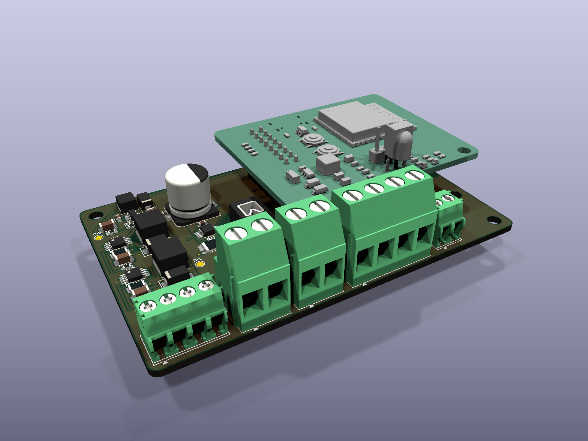
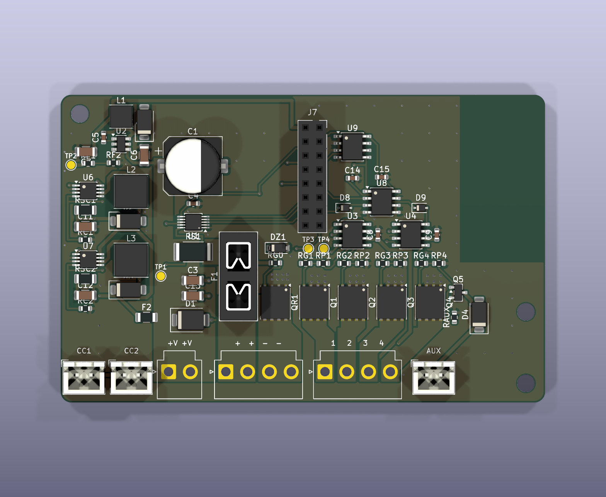
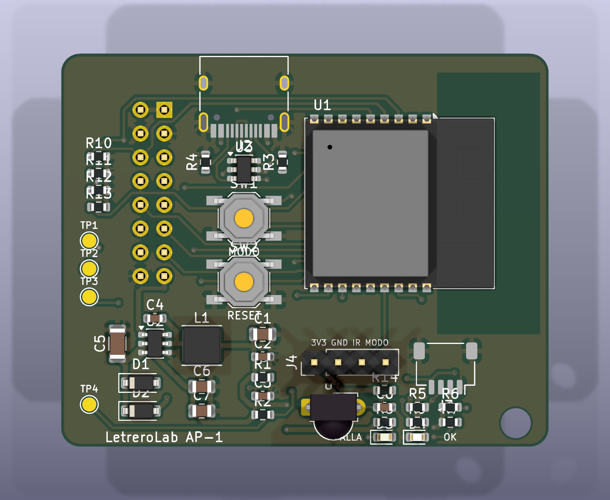
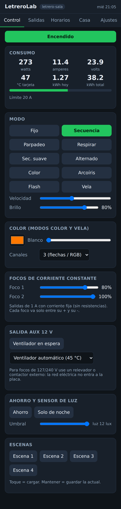
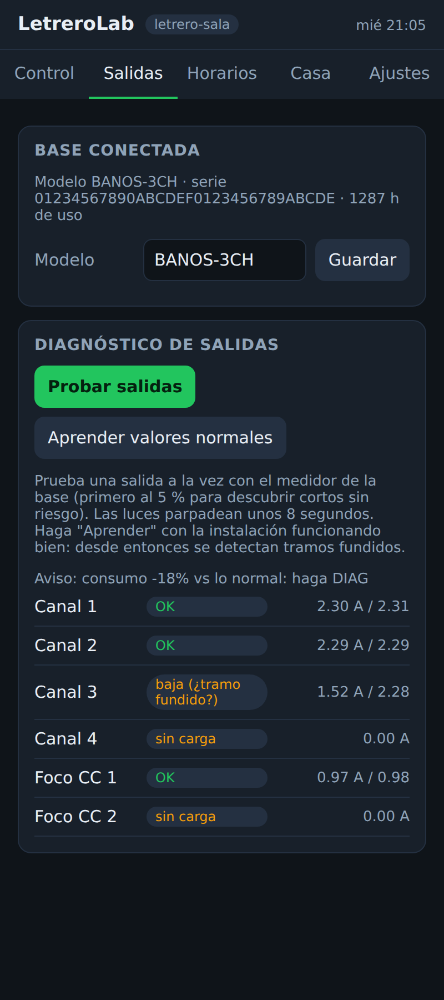
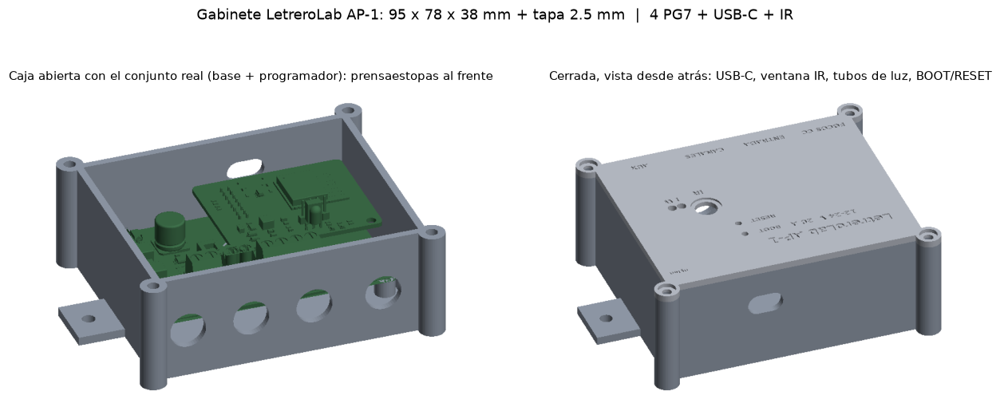

# LetreroLab AP-1: base universal + programador que se enclava

El sistema tiene tres partes:

| Parte | Qué es | ¿Cambia por modelo? |
|---|---|---|
| **Base universal** (`ap1-base/`) | Placa de potencia: entrada protegida y medida, 4 canales de 8 A, 2 canales de **corriente constante** para focos, salida AUX, sensores y la memoria de la base | **No**: es la misma para todos |
| **Programador** (`ap1-prog/`) | El cerebro: ESP32-C3 con Wi-Fi, USB-C, botones, IR, LEDs y conector Qwiic. **Se enclava encima** de la base | No |
| **Placa de LEDs o focos** | La que lleva la luz: letrero BAÑOS, flechas, lámpara, tira… | **Sí**, una por modelo. Se conecta a los conectores de la base (JST VH y XH) |
| **Módulo industrial IND** (`ap1-ind/`) | En lugar de la base: 4 salidas **0-10 V aisladas** para drivers de naves industriales, paneles y reflectores, y 2 salidas para la **bobina de un contactor** que enciende luces de 127/240 V (la red no entra a la placa) | No. El programador lo reconoce solo |

| **Módulo de pixeles PIX** (`ap1-pix/`) | En lugar de la base: 4 salidas para tiras y letreros de **pixeles direccionables** (WS2812/SK6812/WS2815, 5-24 V), con brillo limitado por corriente medida | No. El programador lo reconoce solo |

> Todo el ecosistema (qué módulo usar con cada tipo de luz, cable o enclavado, módulos propuestos) está en **[ECOSISTEMA.md](ECOSISTEMA.md)**.

**Por qué conviene así:**
- **Se fabrica una sola base para todo.** Mientras más piezas iguales, más barato y mejor probado sale cada lote.
- **El modelo vive en la memoria de la base**, no en la placa:
  - nombre del modelo;
  - consumo normal de cada salida;
  - horas de uso;
  - un **número de serie único**, que sirve para las **garantías**. Lo crea el programa la primera vez que ve la base: 128 bits al azar mezclados con la MAC del programador. La memoria es una M24C02 (Preferred, sin cargo por tipo). Si se monta una AT24CS02, el programa usa su serie de fábrica.
- **Servicio en campo rápido:** si algo falla, se cambia solo el programador (un tornillo) o solo la base.
- **Más seguro:** la red de 127/240 V **no entra a ninguna placa**. Los focos normales se manejan con un relevador o contactor externo desde la salida AUX, como se pidió desde el principio.

## Medidas

| | Base | Programador | Conjunto |
|---|---|---|---|
| Tamaño | 88 × 56 mm, esquinas redondeadas | 52 × 42 mm | 88 × 56 mm de planta |
| Capas / cobre | **4 capas**: exteriores 2 oz, interiores 1 oz | 2 capas, 1 oz | |
| Piezas | 68 (todo SMD, salvo conectores, portafusible y zócalo) | 41 | |

Frente a la AP-0.2 (90 × 70 mm, 6300 mm²), la base ocupa **4928 mm² (22 % menos)** y además trae los 2 canales de corriente constante, la memoria de identidad y la salida AUX.

## Las 4 capas de la base (y por qué no hay piezas abajo)

| Capa | Uso |
|---|---|
| F.Cu (arriba, 2 oz) | piezas, pistas de señal y los planos de potencia (VIN, canales) |
| In1.Cu (1 oz) | **plano de GND completo**: referencia para el sensado y la conmutación |
| In2.Cu (1 oz) | **segundo plano de GND**: más cobre para el regreso de 20 A hacia QR1 y para sacar calor |
| B.Cu (abajo, 2 oz) | pistas largas (12 V, CTRL de los focos), regreso de corriente y GND |

- Las dos capas internas son **planos** (KiCad las marca como "power"): Freerouting no pasa pistas por ellas, solo llega con vías.
- **Vías de costura** GND cada 5 mm (unas 60) unen arriba, abajo y los dos planos. Ninguna isla de cobre queda suelta.
- Bajo la antena del programador se quita el cobre en **las 4 capas**.
- Pila de JLCPCB: **JLC04161H-7628**, 1.6 mm. A JLCPCB una de 4 capas de este tamaño le cuesta poco más que una de 2.
- **Lado inferior sin piezas, a propósito:** el ensamble por las dos caras cuesta más (doble esténcil y doble paso de horno). Además la base va atornillada al gabinete por abajo y ahí conviene una cara plana y aislada. El cobre de abajo sí se usa completo.
- El programador sigue en 2 capas: es chico y de baja corriente, y la antena necesita poco cobre alrededor. Por abajo solo lleva el conector macho que se enclava.

## Cómo se enclavan

- **Base:** zócalo hembra 2×8 de 2.54 mm (J7) y agujero M3 en (84.5, 39.5).
- **Programador:** conector macho 2×8 **por debajo** (J1) y agujero M3 en la misma posición.
- **Montaje:** separador de **11 mm** (zócalo de 8.5 mm + plástico del conector de 2.5 mm) con **tornillo de nylon**. Queda junto a la antena y uno de metal la desafinaría.
- **No se puede poner al revés:** girado 180°, el programador se sale de la base y el agujero no coincide.
- **Antena:** la base tiene una **zona sin cobre** (x 72.5–88, y 0–30.5) justo debajo de la antena del ESP32-C3, en las cuatro capas.
- **Altura:** bajo el programador solo hay piezas bajas (≤ 4.5 mm). El portafusible y el capacitor alto quedan fuera, y los conectores quedan libres al frente.
- **Verificación:** las 16 patas del conector macho coinciden en posición y en señal con las 16 del zócalo.

Señales del conector (iguales en las dos placas):

| Pata | Señal | Pata | Señal |
|---|---|---|---|
| 1, 2 | +12 V de la base | 3, 4, 16 | GND |
| 5, 6, 7, 8 | PWM canales 1-4 | 9, 10 | CTRL focos CC 1 y 2 |
| 11, 12 | SDA, SCL (I2C) | 13 | ALERTA (protecciones) |
| 14 | AUX | 15 | 3.3 V del programador a los sensores de la base |

## Base universal

**Entrada (J1, 12–24 V, máximo 26 V, hasta 20 A):**
- **Fusible mini de auto (ATM)**: se cambia sin soldar; se consigue en cualquier refaccionaria.
- Protección de polaridad invertida sin pérdidas: un MOSFET de 1.6 mΩ (0.6 W a 20 A).
- **Supresor SMBJ26A contra picos:** empieza a conducir a 28.9 V y limita a 42 V, que es lo máximo que aguantan los AL8860. El SMBJ33A anterior dejaba pasar hasta 53 V: una fuente de 24 V conectada en caliente podía quemarlos. Por eso la entrada máxima es 26 V (una fuente de 24 V ajustada al tope da 26.4 V).
- **Medidor INA238** de 85 V con shunt de 1 mΩ y 2 W (HoJLR2512, en existencia en JLCPCB), con sensado Kelvin en el borde interior de cada terminal mediante una huella propia ("net tie"): V, A, W y kWh, y alerta por sobrecorriente.

**Protección por hardware (no depende del programa):**
- La línea ALERTA del INA238 (sobrecorriente, sobrevoltaje de 28 V) y del TMP1075 (85 °C) llega a los **EN de los dos UCC27524** a través de D8 y D9 (1N4148WS).
- Al dispararse, los 4 MOSFET se apagan en unos 20 ns después de la alerta, aunque el ESP32 esté trabado o reiniciándose.
- El medidor compara cada conversión sin promediar, así que la alerta llega en menos de 1 ms. La alerta queda retenida hasta que el programa la atiende; después reintenta como antes (3 veces, cada 10 s).
- Los diodos son necesarios: los EN del UCC27524 tienen un pull-up interno a 12 V que, sin ellos, metería 12 V a la línea de 3.3 V del ESP32 y del TMP1075.
- Los focos CC no se cortan por hardware: su corriente ya está limitada (1 A) y tienen su fusible F2.

**Salidas, todas en el borde de abajo para cablear por un solo lado de la caja:**

| Conector (AP CONNECT) | Salida |
|---|---|
| **J1** JST VH 4 patas: 1-2 = +, 3-4 = - | **Entrada** 12-24 V DC, hasta 20 A (10 A por pata) |
| **J3** JST VH 2 patas `+V +V` | Positivo común de tiras y letreros |
| **J4** JST VH 4 patas `CH1…CH4` | Negativo conmutado de cada canal, **8 A** c/u (MOSFET 2.8 mΩ + driver), PWM de 19.5 kHz desfasado |
| **J5, J8** JST XH 2 patas: 1 = +, 2 = - | **Focos de corriente constante 1 y 2**, 1 A cada uno; LEDs de hasta unos 2 V menos que la entrada (ver nota) |
| **J6** JST XH 2 patas: 1 = 12 V, 2 = AUX | 12 V y salida conmutada, máx. **0.3 A**: bobina de relevador o contactor, o ventilador |

**Corriente constante (AL8860):**
- La corriente la fija una resistencia: `I = 0.1 V / R`. Con 0.1 Ω (la de serie) son **1 A**; con 0.15 Ω, 0.67 A; con 0.33 Ω, 0.3 A.
- El voltaje de los LEDs debe ser **menor que la entrada menos ~2 V**. Con 24 V caben unos 6 LEDs blancos de potencia en serie; con 12 V, unos 3.
- **Las salidas CC son flotantes:** cada foco va **solo** entre su `+` y su `-`. No se unen a tierra ni a otras salidas; la serigrafía lo advierte.
- Llevan su **propio fusible** (F2, 3 A) y se atenúan desde la app.

**Otras partes de la base:**
- **Fuente conmutada a bordo:** LMR16006 de 60 V a 12 V, con su diodo de rueda libre. Alimenta drivers, AUX y programador.
- **Sensores:** temperatura TMP1075 junto a los MOSFET. La memoria M24C02 guarda modelo, consumo normal, horas de uso y número de serie.
- **Diseño del cobre:**
  - Planos de potencia de 7–11 mm.
  - Una **franja de retorno** en la capa inferior donde no se permiten pistas, para que la corriente de los 4 canales regrese sin rodeos.
  - Áreas prohibidas al rutear sobre todos los planos de potencia.
- **Arranque seguro:** sin programador, todas las salidas quedan apagadas por resistencias: gates a GND, CTRL a 2.2 k, AUX a 10 k.

## Programador

- **ESP32-C3-WROOM-02:** Wi-Fi y Bluetooth LE certificados.
- **USB-C** con protección ESD. Sirve para programar y también para probar el programador solo, sin base.
- **Fuente conmutada AP63203** a 3.3 V, alimentada desde los 12 V de la base o desde el USB (diodos en OR).
- **Botones MODO/BOOT y RESET.**
- **LED verde OK**, que maneja el programa.
- **LED rojo FALLA por hardware:** sigue a la línea ALERTA aunque el programa esté detenido.
- **Receptor IR** a bordo. El conector **J4** (3V3, GND, IR, MODO) sirve para poner un ojo IR y un botón en la tapa de la caja.
- **Conector Qwiic** (JST-SH de 4 patas, I2C). Se conecta sin soldar:
  - pantalla **OLED SSD1306** de 0.96";
  - sensor de luz **BH1750**;
  - reloj **DS3231**.
- **Pull-down de 10 k en los 4 PWM:** al conectar, el ESP32-C3 puede dejar esas patas con pull-up débil unos 0.3 s, lo que encendería los canales de 8 A.
- **IO21 al LED verde:** IO21 transmite el registro de arranque, así que solo hace parpadear el LED. En una salida de luz haría parpadear un foco.

## Programa (`ap1-prog/firmware/LetreroLabAP1`)

Es el mismo programa de la AP-0.2 (app web, horarios, toda la casa, MQTT, OTA, protecciones), con lo nuevo:

- **Diagnóstico de salidas** (pestaña *Salidas* u orden `DIAG`):
  - Prueba cada salida **por turno** con el medidor de precisión de la base.
  - Primero al **5 %**: si a 100 % pasaría del límite, la marca como **corto** sin llegar a encenderla fuerte.
  - Luego al 100 % y mide su corriente.
  - Califica cada salida: **OK**, **sin carga** (cable suelto o LED abierto), **corto**, **baja** (tramo fundido) o **alta**.
- **Aprender** (`APRENDER`):
  - Con la instalación funcionando bien, guarda en la base el consumo normal de cada salida.
  - Desde entonces, en modo fijo o color, el equipo **avisa solo** si el consumo se aleja más de 25 % de lo esperado, sin apagar nada para medir.
- **Focos CC** (`O a b`), **AUX** manual o **ventilador automático** (`Y 1`, enciende a 45 °C).
- **Datos de la base:** modelo (`MODELO texto`), número de serie y horas de uso, en la app y en la pantalla OLED.
- **Pantalla OLED** opcional: IP, V/A/W, temperatura, kWh de hoy, modo, falla o aviso, resumen de salidas y serie de la base.

| Control | Salidas |
|---|---|
|  |  |

**Compilación y grabación:**
- **Reconoce el módulo (fw 1.1):** si debajo hay un módulo industrial IND (memoria `LL-IND` o sin medidor), cambia solo:
  - canales 1-4 a salidas 0-10 V lineales (PWM de 2 kHz con la curva del filtro corregida);
  - AUX como contactor 1, que sigue al encendido;
  - CTRL 1 como contactor 2 manual;
  - la app y Home Assistant muestran los controles de ese módulo.
- **Home Assistant (fw 1.1):** con MQTT configurado, el equipo **aparece solo** en Home Assistant (descubrimiento MQTT, igual que Shelly, Tasmota o WLED). Aparecen:
  - la luz, con brillo y los 10 efectos;
  - el interruptor AUX;
  - los dos focos CC (0–100 %);
  - el botón "Probar salidas";
  - los sensores de voltaje, corriente, potencia, energía, temperatura, señal y falla.
  `HA 0` lo retira de Home Assistant y `HA 1` lo vuelve a anunciar. Por MQTT se pueden mandar varias órdenes en un mensaje, una por renglón.
- **Estado:** compila sin advertencias (1.35 MB, 68 % de la flash). La app se probó en navegador contra un simulador.
- **Compilar:** `bash hardware/tools/compilar_esp32.sh ap1`. Los binarios quedan en `ap1-prog/firmware/binarios/`.
- **Grabar:** el archivo `_completo_0x0.bin` va por USB-C en la dirección 0x0; el `_actualizacion_OTA.bin` va por Wi-Fi.

## Gabinete (`ap1-gabinete`)

- **Imprimible** en PETG o ASA (PLA no: se ablanda al sol y con el calor de la base): `caja_base.stl` y `caja_tapa.stl`. Mide 95 × 78 × 38 mm, más la tapa de 2.5 mm.
- **Medido contra el modelo 3D real** del conjunto (`ap1-ensamble/AP1_Ensamble.step`). El generador falla si alguna pieza toca la caja; hoy da **0 choques** y **2.5 mm de aire** bajo la tapa (lo más alto es el receptor IR).
- **Montaje:**
  - la base va sobre 3 postes de 6 mm con inserto de latón M3, en los mismos 3 agujeros de la placa;
  - el poste del programador lleva el **tornillo de nylon** que atraviesa las dos placas.
- **Frente:** 4 prensaestopas PG7 (focos CC, entrada, canales, AUX), con 16 mm de espacio para la tuerca y el doblez del cable.
- **Atrás:** ventana para el **USB-C**, para programar o actualizar sin abrir.
- **Tapa:**
  - ventana de 8 mm para el receptor **IR**, con asiento para un disco de acrílico rojo o humo de 11 mm;
  - 2 agujeros para **tubos de luz** de 3 mm × 21 mm (LED de falla y de Wi-Fi);
  - agujeros para apretar **BOOT y RESET con un clip**;
  - textos grabados.
- **Cierre:** 4 tornillos M3 en columnas por fuera de la placa. La columna de atrás a la derecha queda junto a la antena: usa tornillo de **nylon** (está grabado en la tapa).
- **Pared:** 2 orejas con agujero de 4.5 mm.
- **Caja comprada:** `plantilla_caja_comprada_1a1.pdf` trae, a escala 1:1, los barrenos del fondo, del frente y del USB-C. Usa caja de **plástico**: una metálica bloquea el Wi-Fi.
- **Generar de nuevo:** `pip install manifold3d trimesh matplotlib pymupdf cascadio rtree fast_simplification` y luego `python3 ap1-gabinete/gen/caja.py`.
- **Faltan en la revisión:** el USB-C y el conector Qwiic no tienen modelo 3D. El fusible mini no viene en el modelo del portafusible, pero sobresale unos 18 mm y queda por debajo de la tapa.

## Pedir a JLCPCB

> **Guía paso a paso y archivos listos para subir: [PEDIDO_JLCPCB.md](PEDIDO_JLCPCB.md)** (carpeta `PEDIDO_JLCPCB/`).

Son **dos pedidos** (o uno con dos diseños). Cada carpeta `fabricacion/jlcpcb/` trae:
- el Gerber (ZIP);
- la BOM con el **código LCSC y la clase** (Basic / Preferred / Extended) de cada pieza;
- el CPL;
- `RESUMEN_JLCPCB.txt`, con cuántos tipos son Extended, el cargo aproximado de montaje (~3 USD por tipo, por pedido) y el costo de las piezas Basic;
- un segundo juego **`_solo_SMD`** (BOM y CPL) para el **pedido económico**: JLCPCB arma solo lo SMD, y los conectores y el portafusible se sueldan a mano. Así esas piezas no pagan cargo de montaje y no hace falta el ensamble THT.

**Ahorro en el cargo de montaje por pedido** (cada tipo Extended cuesta ~3 USD):

| Placa | Antes | Ahora, todo armado | Ahora, económico (`_solo_SMD`) |
|---|---|---|---|
| Base | ~60 USD (20 tipos) | ~57 USD (19) | ~36 USD (12) |
| Programador | ~33 USD (11) | ~27 USD (9) | ~18 USD (6) |
| **Los dos** | **~93 USD** | **~84 USD** | **~54 USD** |
| AP-0.2 (mismo cambio de botones) | ~66 USD (22) | ~60 USD (20) | ~39 USD (13) |

Las piezas Basic/Preferred cuestan ~0.70 USD por base y ~0.24 USD por programador (precio de catálogo).

Qué se cambió para llegar ahí:
- memoria **AT24CS02 → M24C02** (Preferred). El número de serie lo crea el programa.
- botones **TL3342 → TS-1187A** (Basic). Misma huella en la práctica.
- diodos **SS14 → B5819W** (Preferred).
- el resumen cuenta los tipos por código LCSC, igual que JLCPCB: los dos botones son un solo tipo.

1. **Base** (`ap1-base`): **4 capas**, pila JLC04161H-7628, **exteriores 2 oz, interiores 1 oz**, ensamble del lado superior.
2. **Programador** (`ap1-prog`): 2 capas, 1 oz, ensamble del lado superior. El **conector macho 2×8 va abajo**: pídelo con ensamble THT o suéldalo tú.
3. En la revisión de cada BOM, confirma los códigos LCSC. Las piezas sin código son Extended y se eligen ahí mismo:
   - INA238, AL8860, LMR16006, UCC27524, TMP1075;
   - MOSFET BSC028N06LS3 / BSC016N06NS;
   - portafusible Keystone 3568;
   - zócalo 2×8.
   La biblioteca Basic de JLCPCB no tiene equivalentes de estas piezas con los mismos 60 V, 8 A o 1 mΩ, así que se quedan como Extended.
4. En la vista previa del ensamble, revisa el **giro** de los integrados, MOSFET, diodos y USB-C.

**Primera tanda sugerida:** 5 bases y 5 programadores. Pruebas antes de pedir más:
- temperatura a 20 A durante 1 h;
- corte de la protección con carga electrónica, también con el botón RESET del programador apretado (el corte por hardware debe actuar sin el programa);
- pico de conexión en caliente con fuente de 24 V: medir con osciloscopio en VCC de los AL8860 (debe quedar bajo 42 V);
- diagnóstico con salidas abiertas, en corto (con fuente limitada) y con un tramo desconectado;
- focos CC a 1 A durante 72 h;
- Wi-Fi con el programador montado dentro de la caja.

## Biblioteca JLCPCB

- **Instalar:** `bash hardware/tools/descargar_biblioteca_jlcpcb.sh` baja la biblioteca **JLCPCB-KiCad-Library** (CDFER, MIT). Trae unas 1500 piezas Basic/Preferred con símbolo, huella, modelo 3D y código LCSC, y deja las instrucciones para KiCad 9. También está en el Administrador de complementos de KiCad como "JLCPCB".
- **Catálogo:** de esa biblioteca sale `tools/jlcpcb_catalogo.csv` (código, clase, existencias, precio). `tools/jlcpcb.py` busca ahí cada pieza de la placa:
  - resistencias por valor y tamaño;
  - capacitores por valor, tamaño y voltaje mínimo (lo de "10uF 50V");
  - LED por color;
  - semiconductores por número de parte y encapsulado.
  Prefiere Basic, luego Preferred, y entre ellos la de más existencias. `tools/salidas.py` lo usa al hacer la BOM.
- **Prueba rápida:** `python3 tools/jlcpcb.py 4.7k R_0603_1608Metric`.
- **Piezas Extended desde KiCad:** el complemento **JLCPCB Tools** (Bouni/kicad-jlcpcb-tools) busca en todo el catálogo de JLCPCB y escribe el código LCSC en la placa.
- **Cambios por la biblioteca:**
  - los diodos SS14 del programador pasaron a **B5819W** (Preferred, misma huella SOD-123, 40 V 1 A);
  - el resto de pasivos, LED, SS34, SS210, SMBJ26A, MMSZ5242B, 1N4148WS y AO3400A ya eran Basic/Preferred.

## Cómo se diseñó y se revisa

- **Una librería, una carpeta por placa:** las placas salen de `tools/placa.py`, la librería común de generación. Cada placa es un archivo de datos: `ap1-base/gen/make.py` y `ap1-prog/gen/make.py`.
- **Comandos:**
  - `bash tools/rutear.sh ap1-base AP1_Base` → genera la placa, rutea con Freerouting en 3 pasadas, rellena los planos y corre ERC/DRC.
  - `python3 tools/salidas.py ap1-base AP1_Base` → archivos de fábrica, PDF, STEP y renders.
  - `python3 tools/modelos_locales.py ap1-base AP1_Base` → copia los modelos 3D dentro del proyecto.
  - `python3 ap1-ensamble/ensamble.py` → modelo 3D del conjunto (base + programador a 11 mm). Sirve para diseñar la caja.
- **Placas a 4 capas:** `CAPAS = 4` y `COSTURA = 5.0` en el `make.py` de la placa. `placa.py` hace los planos internos y las vías de costura, y `salidas.py` exporta las capas que haya.
- **Revisión:** las dos placas dan **ERC 0, DRC 0 (incluidas advertencias), 0 sin conectar y 0 diferencias** entre esquema y placa.

## Pendientes y advertencias honestas

- **Nada de esto se ha fabricado ni probado todavía.** El orden de pruebas está arriba.
- **Ruteo automático:** las señales las trazó Freerouting. Las rutas críticas son fijas (sensado Kelvin, 12 V, CTRL de los focos, planos). Antes de un lote grande conviene una revisión visual en KiCad.
- **Diagnóstico de los focos CC:** el medidor está a la entrada, así que para los focos ve la potencia de entrada, no la corriente del LED. Sirve para comparar contra lo aprendido (abierto, bajo, alto), no como medición absoluta en amperes del foco.
- **PWM del AL8860:** se usa a 1 kHz. Hay que confirmar en las primeras placas que la atenuación es pareja; si no, se baja la frecuencia en `CC_HZ`.
- **Modelos 3D faltantes:** USB-C y conector Qwiic (no están en la librería de KiCad) y el shunt (se muestra con el cuerpo de una 2512). Solo afecta las imágenes.
- **AUX:** la salida es de 0.3 A. Un contactor grande necesita su propio relevador intermedio.
