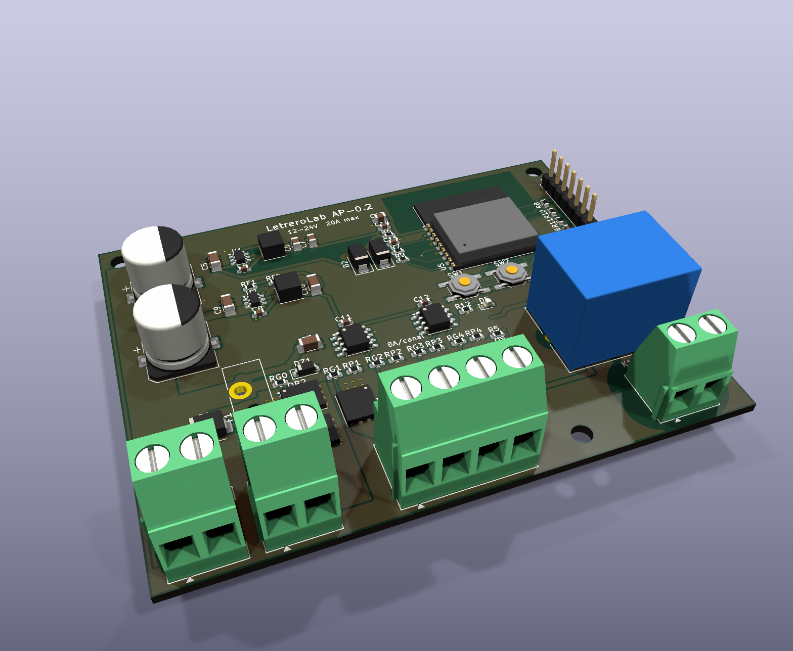
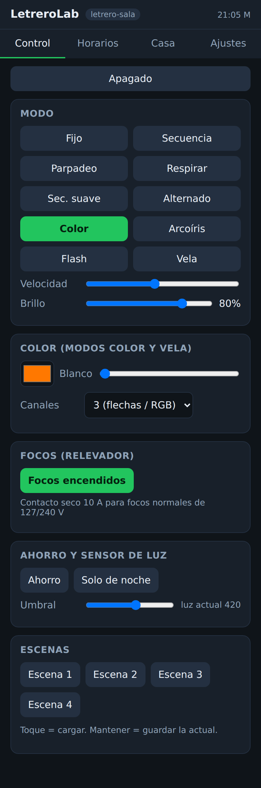
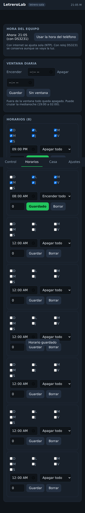
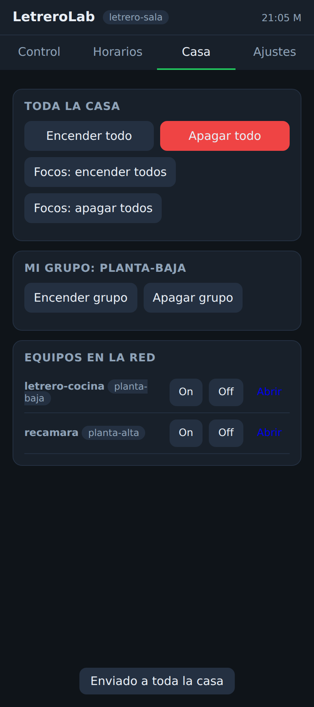
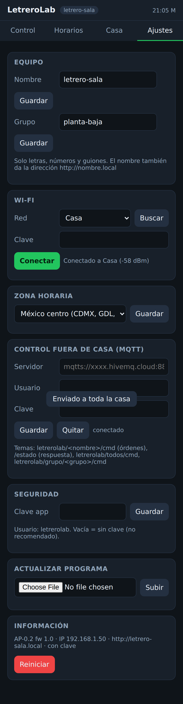

# LetreroLab AP-0.2: controlador Wi-Fi de alta potencia

Una sola placa de **90 × 70 mm**, 2 capas, armada en fábrica (JLCPCB). Sirve para letreros, tiras LED y focos normales, y se controla desde el celular en toda la casa, o desde fuera con MQTT.



## Lo que mejora frente al AP-0.1

| | AP-0.1 | **AP-0.2** |
|---|---|---|
| Cerebro | ATmega328P + Bluetooth enchufable | **ESP32-C3-WROOM-02**: Wi-Fi y BLE en un módulo ya certificado (FCC/CE) |
| Placas | 2 (potencia + cabezal), para planchar | **1**, SMD, ensamble en fábrica |
| Alimentación | Fuente de 127/240 V integrada (12 V, 10 W) | **12–24 V DC externa, hasta 20 A** (480 W a 24 V) |
| Canales | 4 × ~3 A | **4 × 8 A**, MOSFET de 2.8 mΩ con driver de compuerta |
| PWM | 490 Hz, 8 bits | **19.5 kHz, 12 bits**: sin zumbido ni parpadeo en cámara; desvanecidos suaves |
| Hora | DS3231 obligatorio | **Internet (NTP)**; el DS3231 es opcional como respaldo |
| Alcance | Bluetooth, unos 10 m | **Wi-Fi de la casa**, todos los pisos; fuera de casa por MQTT |
| Programar | Adaptador USB-serie | **USB-C directo**, o **por Wi-Fi (OTA)** sin abrir la caja |

## Cómo aguanta la potencia

- **Entrada protegida:**
  - Fusible automotriz **ATO de 20 A**, fácil de conseguir.
  - TVS **SMBJ33A** contra picos.
  - **Protección contra polaridad invertida sin pérdidas:** 2 MOSFET de 60 V en paralelo en el negativo. Disipan unos 0.3 W cada uno a 20 A, contra unos 12 W de un diodo.
- **Canales:**
  - **BSC028N06LS3** (60 V, 2.8 mΩ) movidos por un driver **UCC27524** a 12 V, de modo que el MOSFET conmuta a fondo y rápido.
  - A 8 A, cada MOSFET disipa unos 0.25 W y se mantiene tibio.
  - Una resistencia de 10 k mantiene cada canal apagado mientras arranca el programa.
- **Cobre:**
  - Todas las rutas de potencia son **planos de cobre**, no pistas. Van en la capa superior, con arreglos de vías al plano de tierra inferior.
  - **Pide la placa con cobre de 2 oz** (70 µm). Con 1 oz funciona hasta unos 12 A en total.
- **Clemas:** Phoenix MKDS-3 de 5.08 mm, de 24 A. **+V sale por 2 polos** para repartir la corriente.
- **Relevador** de 10 A con contacto seco para focos de 127/240 V:
  - Tiene **5 mm de separación** entre la red y la parte de baja tensión. Es una regla del diseño que el DRC verifica.
  - Los focos de red **solo** se conectan a J5.
- **Fuentes internas:**
  - Buck **AP63203** a 3.3 V y buck **AP63200** a 12 V, para los drivers y la bobina.
  - Rinden más del 85 % con 12 o 24 V.
  - Sin reguladores lineales calientes, lo que también es más ecológico.

**Fuente recomendada:** un eliminador o fuente cerrada **certificada** de 12 o 24 V (Mean Well LRS/HLG o similar), dimensionada al 80 % de su corriente. Ejemplos: 24 V × 15 A (360 W) para unos 12 A de LED, o 12 V × 10 A.

Al poner la parte de 127 V **fuera de la placa** (en una fuente certificada), el producto es mucho más fácil de vender y certificar.

## Conexiones

| Clema | Qué va |
|---|---|
| **J1** `+` `-` | Entrada de la fuente de 12–24 V |
| **J3** `+V` `+V` | Positivo común de las tiras o del letrero (ánodo común) |
| **J4** `CH1`…`CH4` | Negativo de cada sección o color: R, G, B, W, o 4 secciones del letrero |
| **J5** `COM` `NO` | Interruptor para focos de 127/240 V, hasta 10 A (como un apagador) |
| **J2** USB-C | Programar y ver mensajes. También alimenta la parte lógica para pruebas, sin potencia |
| **J6** | Expansión: 3V3, GND, SDA, SCL, receptor IR (VS1838B), LDR a GND, botón externo |

**Botón MODO** (SW1):
- Toque: cambia de modo.
- 1 s: cambia la velocidad.
- 3 s: enciende o apaga todo.
- **10 s: borra el Wi-Fi** y abre la red de configuración.

**RESET** (SW2): reinicia el módulo.

**LED de estado:**
- Parpadeo muy rápido: modo configuración.
- Medio: buscando el Wi-Fi.
- Lento: funcionando.
- Rápido: en pausa por horario o sensor.

## Primer uso (sin cables, desde el celular)

1. Alimenta la placa. Si no tiene Wi-Fi guardado, crea la red **`LetreroLab-xxxx`** con clave **`letrerolab`**.
2. Conéctate a esa red desde el celular. Se abre la app sola (portal cautivo); si no, entra a `http://192.168.4.1`.
3. **Ajustes → Wi-Fi:** elige la red de tu casa y escribe su clave. El equipo se reinicia y se conecta.
4. Ya en tu red, ábrelo como **`http://letrero-xxxx.local`**, o por su IP (en Android, desde la lista de dispositivos del router).
5. **Ajustes:** ponle **nombre** (`sala`, `cocina`), **grupo** (`planta-alta`) y **zona horaria**. **Pon una clave** a la app: el usuario es `letrerolab`.

Si se cae el Wi-Fi de la casa por más de 30 s, el equipo vuelve a abrir su red de configuración y sigue funcionando con sus horarios. Cuando regresa el Wi-Fi, la red de configuración se cierra sola.

## La app (incluida en el módulo, no hay que instalar nada)

| Control | Horarios | Casa | Ajustes |
|---|---|---|---|
|  |  |  |  |

- **Control:**
  - Encendido.
  - 10 modos: fijo, secuencia, parpadeo, respirar, secuencia suave, alternado, color, arcoíris, flash y vela.
  - Velocidad, brillo, color RGBW, número de canales.
  - Focos, ahorro (máximo 60 %), sensor de luz.
  - 4 escenas.
- **Horarios:**
  - **8 horarios por día de la semana**, por ejemplo "lunes a viernes 21:00 → apagar todo" o "todos los días 19:00 → focos encendidos".
  - Ventana diaria de encendido.
  - Botón para poner la hora del teléfono.
- **Casa:**
  - **Encender o apagar toda la casa**, o solo los focos.
  - Encender o apagar **tu grupo**.
  - Lista de los demás LetreroLab de la red, con On/Off y enlace a cada uno.
  - Funciona por difusión UDP en la red local, en todos los pisos que cubra el Wi-Fi.
- **Ajustes:** nombre, grupo, Wi-Fi, zona horaria, MQTT, clave, **actualizar programa** (subir `.bin`) y reiniciar.

**Para casas grandes o de dos pisos:**
- Todos los equipos deben estar en la misma red Wi-Fi.
- Si el Wi-Fi no llega bien a un piso, conviene un sistema **mesh** o un repetidor. El ESP32-C3 se comporta como un celular más.
- La app de cualquier equipo controla a todos.

### Control fuera de casa (MQTT)

Crea una cuenta gratuita en un servidor MQTT en la nube, por ejemplo HiveMQ Cloud o EMQX Cloud. En **Ajustes → MQTT** escribe:
- Servidor: `mqtts://xxxxx.s1.eu.hivemq.cloud:8883`.
- Usuario y clave.

La conexión va cifrada (TLS) y verifica el certificado.

| Tema | Uso |
|---|---|
| `letrerolab/<nombre>/cmd` | Órdenes, por ejemplo `P0` o `X1` |
| `letrerolab/<nombre>/estado` | Estado en JSON (retenido) |
| `letrerolab/<nombre>/conectado` | `1` / `0` |
| `letrerolab/todos/cmd` | Órdenes a todos los equipos |
| `letrerolab/grupo/<grupo>/cmd` | Órdenes a un grupo |

Desde el celular se puede mandar con una app MQTT (IoT MQTT Panel, MQTT Dash). También sirve para conectarlo con Home Assistant o Node-RED.

### Protocolo

Es el mismo del AP-0.1, más las órdenes nuevas. Funciona por USB a 115200, por `http://equipo/api?c=...` y por MQTT. La lista completa está en la cabecera de [`LetreroLabAP02.ino`](firmware/LetreroLabAP02/LetreroLabAP02.ino). Ejemplos:

```
P 0                    apagar          X 1         focos encendidos
M 6                    modo color      C 255 0 0 0 rojo
A 0 62 21:00 0 0       horario 0: lunes a viernes (2+4+8+16+32=62) a las 21:00 -> apagar todo
A 1 127 19:00 2 1      horario 1: todos los días a las 19:00 -> focos encendidos
@* P0                  apagar TODOS los equipos de la casa
@planta-alta P1        encender el grupo planta-alta
Z CST6                 zona horaria del centro de México
```

## Programa

- **Fuente:** `firmware/LetreroLabAP02/`. Arduino-ESP32 3.x; placa *ESP32C3 Dev Module*; *USB CDC On Boot: Enabled*; esquema de particiones *Minimal SPIFFS*, que deja espacio para OTA.
- **Ya compilado:**
  - `firmware/binarios/LetreroLabAP02_completo_0x0.bin`: para la primera grabación por USB-C. Se graba en la dirección 0x0 con [ESP Web Tool](https://espressif.github.io/esptool-js/) desde Chrome, sin instalar nada.
  - `firmware/binarios/LetreroLabAP02_actualizacion_OTA.bin`: para **Ajustes → Actualizar programa**.
- **Compilar sin IDE:** `bash hardware/tools/compilar_esp32.sh`. Para grabar por USB, agrega `PUERTO=/dev/ttyACM0`.
- **Primera grabación con el chip vacío:**
  1. Mantén **MODO/BOOT**.
  2. Presiona y suelta **RESET**.
  3. Suelta BOOT.
  4. Graba.

  Las siguientes grabaciones son automáticas por USB o Wi-Fi.

El programa compila sin advertencias (1.33 MB, 67 % de la flash). La app se probó en navegador contra un simulador. **Falta probarlo en la placa real**: es la primera tarea al llegar las placas.

## Pedir la placa en JLCPCB

Todo está en `fabricacion/jlcpcb/`:

1. **jlcpcb.com → Order now** y sube `AP02_gerber_JLCPCB.zip`.
   - 2 capas, 90 × 70 mm, FR-4 1.6 mm.
   - **Outer copper weight: 2 oz.**
   - Color a elegir.
   - "Remove order number": *Specify a location*, o paga la opción para quitarlo.
2. Activa **PCB Assembly**, lado superior (Top), tipo *Economic* o *Standard*.
3. Sube `AP02_BOM_JLCPCB.csv` y `AP02_CPL_JLCPCB.csv`.
4. En la revisión de la BOM, **confirma cada pieza**:
   - Los códigos LCSC del archivo son de referencia: verifica existencia y precio.
   - Para las que van vacías, busca por valor y huella y prefiere *Basic parts*.
   - Las clemas, el portafusible ATO y el relevador son de inserción (THT). Puedes pedirlos con ensamble THT o soldarlos tú, que es más barato.
5. En la vista previa del ensamble, **revisa el giro** de los circuitos integrados, MOSFET, diodos y el USB-C. JLCPCB a veces usa otra rotación de origen; se corrige ahí mismo.
6. Para aduana y fracción arancelaria, ve la [hoja de ruta](../HOJA_DE_RUTA.md#logística-e-importación-jlcpcb--méxico).

**Primera tanda sugerida:** 5 placas armadas. Antes de hacer más, prueba:
- Temperatura con termopar a 20 A durante 1 h.
- 72 h encendido.
- Wi-Fi en los 2 pisos.
- Horarios y caída de luz.

## Archivos

| Carpeta | Contenido |
|---|---|
| `kicad/` | Proyecto KiCad 9: esquema, PCB, reglas y modelos 3D en `kicad/3d` |
| `gen/make.py` | Genera esquema y placa (Python + KiCad), rutea con Freerouting en 2 pasadas e importa |
| `gen/outputs.py` | Gerber, BOM/CPL de JLCPCB, PDF, renders y STEP |
| `fabricacion/` | Salidas listas: `jlcpcb/`, `gerber/`, `esquema/` (PDF), `3d/` (renders y STEP), `reportes/` (ERC/DRC) |
| `firmware/` | Programa, app web, binarios y capturas |

**Verificación:**
- **ERC:** 0 errores y 0 advertencias.
- **DRC:** 0 violaciones, 0 sin conectar, 0 diferencias con el esquema.

Reglas propias del DRC:
- 5 mm entre la red de 127 V y todo lo demás.
- 2 mm en el contacto NC del relevador.
- Pista mínima de 0.15 mm.

### Pendientes y advertencias honestas

- **Ruteo automático:** Freerouting más planos de potencia trazados a mano. Antes de pedir muchas placas, conviene una revisión visual en KiCad, sobre todo de las pistas de señal cerca de los drivers.
- Faltan los modelos 3D del USB-C (HRO TYPE-C-31-M-12) y del portafusible ATO. Solo afecta los renders.
- **Seguridad:**
  - Las órdenes de grupo (UDP) no llevan clave dentro de la red local; solo controlan luces, no la configuración.
  - Cambia la clave de la app.
  - La red de configuración usa la clave fija `letrerolab`; si le pusiste clave a la app, también la pide ahí.
- **Certificación:**
  - El módulo de radio ya está certificado.
  - Para vender el producto terminado en México falta la evaluación del equipo completo (NOM / IFT para el producto con radio). Ve la [hoja de ruta](../HOJA_DE_RUTA.md).
