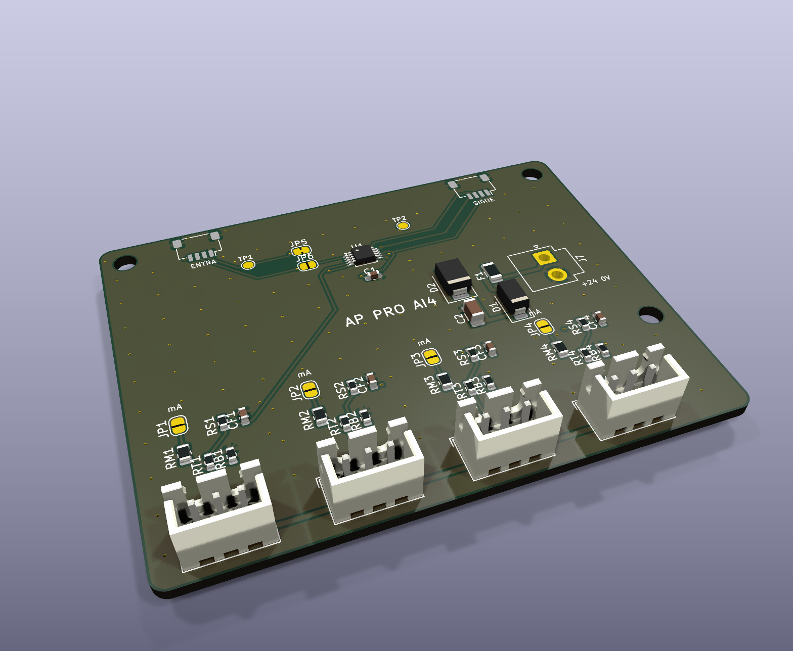

# AP ELECTRIC · AP PRO AI4: 4 entradas analógicas (0-10 V o 4-20 mA)

> Parte de la línea **AP PRO** del ecosistema [AP ELECTRIC](../AP_ELECTRIC.md). Se conecta al CORE por **Qwiic**, sola o en cadena con AP INPUT, DO8 y DIST 4.



**Para qué sirve:** medir sensores con salida analógica y actuar con umbrales:
- nivel de cisternas o tinacos (transmisor 4-20 mA) → encender o apagar la bomba;
- presión de una red de bombeo;
- temperatura o humedad (transmisores 4-20 mA o 0-10 V);
- luz (fotómetro 0-10 V) para atenuar;
- potenciómetros de mando de 0-10 V.

## Conectores (AP CONNECT)

| Conector | Tipo | Qué se conecta |
|---|---|---|
| **J7** 24V | JST VH 2 patas: 1 = +24 V, 2 = 0 V | La fuente de 24 V (**la misma de la base**: el 0 V es la tierra del programador) |
| **AI1-AI4** | JST XH 3 patas: 1 = +24 V, 2 = señal, 3 = 0 V | Cada sensor. La pata 1 da +24 V (con fusible de 3 A) para sensores de 2 o 3 hilos |

**Cableado típico:**
- **Transmisor 4-20 mA de 2 hilos:** + del transmisor a la pata 1, − a la pata 2; **cierra JPn** (modo 4-20 mA).
- **Sensor 0-10 V de 3 hilos:** alimentación a las patas 1 y 3, salida a la pata 2; **JPn abierto**.

## Modos y escalas

| Modo | Puente JPn | Escala | Resolución |
|---|---|---|---|
| 0-10 V | Abierto | 0 a 10.2 V (el ADC llega a 3.3 V tras el divisor de 22k/10k) | unos 0.4 mV |
| 4-20 mA | **Cerrado** (150 Ω a 0 V) | 0 a 21 mA | unos 2 µA |

- **El modo también se elige en el programa:** `AI n 0` (0-10 V) o `AI n 1` (4-20 mA), o desde la app. Debe coincidir con el puente.
- **Con el puente cerrado, NO conectes una fuente de voltaje:** 24 V en 150 Ω son 3.8 W y queman la resistencia.
- **Protección:** si llegan 24 V por error a una entrada de 0-10 V, el ADC recibe 3.9 mA por su diodo de protección (aguanta 10 mA). Es un cálculo; se confirma en la primera tanda.

## Umbrales: acciones por nivel

```
AU n umbral acción valor [modo]        AU n -   (sin umbral)
```
- Las acciones son las mismas que en entradas y horarios: 0/1 luz, 2 AUX, 3 escena, 4 brillo, 5/6/7 salida del DO8, 8 alternar luz.
- Al **subir** del umbral se hace la acción. Con **modo 1 ("mientras")**, al **bajar** se hace lo contrario. Hay 2 % de histéresis para que no oscile.
- **Ejemplo, cisterna con transmisor 4-20 mA en AI1 y bomba en S1:** quieres la bomba encendida mientras el nivel esté **bajo**:
  - `AU 1 8 6 1 1` → por encima de 8 mA apaga S1; al bajar de 8 mA la enciende;
  - o en la app: tarjeta "Entradas analógicas".
- **Ponles nombre:** `ET A1 Nivel cisterna`. Sale en la app y en Home Assistant (sensor de voltaje o de corriente, según el modo).

## Direcciones

- ADS1115 en **0x49** (JP5 cerrado de fábrica).
- **Segundo AI4:** corta JP5 y cierra JP6 → **0x4A**. Hasta 8 canales: A1-A4 en 0x49 y A5-A8 en 0x4A.
- 0x48 no se usa: lo ocupa el sensor de temperatura de la BASE.

## Pedir en JLCPCB

- 2 capas, 1 oz, 72 × 56 mm. Archivos en `fabricacion/jlcpcb/` (y en `PEDIDO_JLCPCB/11_AP_PRO_AI4`).
- Todas las piezas traen código LCSC (ADS1115IDGSR C37593).
- Soporte DIN: `ap1-gabinete/din/soporte_din_72x56.stl`.

## Pruebas antes de instalar

1. Conecta el Qwiic: la consola debe decir `AP PRO AI4: 01` y la app mostrar A1-A4.
2. Pon 5.00 V de una fuente de laboratorio en AI1 (pata 2 y pata 3). Debe leer 5.00 V ±1 % (las resistencias son de 1 %).
3. Modo 4-20 mA: cierra JP2, `AI 2 1` y pon un calibrador de lazo o una fuente con resistencia en serie. 4.00 y 20.00 mA deben leerse con ±1 %.
4. Umbral: `AU 1 5 1 0 1` con AI1 de 0 a 6 V. La luz enciende al pasar de 5.1 V y se apaga al bajar de 4.9 V.
