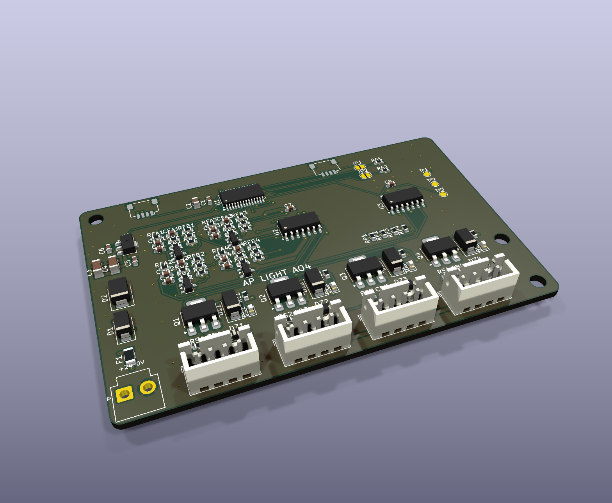

# AP ELECTRIC · AP LIGHT AO4: 4 circuitos de alumbrado 0-10 V + contactor

> Línea **AP LIGHT** del ecosistema [AP ELECTRIC](../AP_ELECTRIC.md). Se conecta al CORE (o a un AP NODE / AP GATE) por **Qwiic**.

**Para qué sirve:** atenuar y apagar luminarias de red que tienen **driver atenuable 0-10 V o 1-10 V**:
- alumbrado público y de privadas;
- estacionamientos y bodegas;
- naves industriales;
- paneles LED de oficina.

Cada circuito tiene dos salidas:
1. **0-10 V** a la entrada de atenuación de los drivers (cable morado y gris, o "DIM+ / DIM−").
2. **Bobina de 24 V DC** del **contactor certificado** que da la red a esos drivers. Con 0 % el circuito queda apagado de verdad: un driver en 0 V no apaga, solo baja al mínimo.

> La red de 127/220 V nunca entra a esta placa. El contactor y los drivers los instala un electricista (ver [ACTUADORES_DE_POTENCIA.md](../ACTUADORES_DE_POTENCIA.md)): contactor para iluminación, cuidando cuántos drivers lleva cada uno por el pico de arranque.

## Conectores

| Conector | Patas | Qué se conecta |
|---|---|---|
| **J3** 24V | JST VH 2: 1 = +24 V, 2 = 0 V | La fuente de 24 V del tablero (la misma del CORE) |
| **J4-J7** C1-C4 | JST XH 4: **1 = +24 V**, **2 = bobina (−)**, **3 = 0-10 V**, **4 = 0 V** | Patas 1-2 a A1/A2 del contactor; patas 3-4 a DIM+ / DIM− de los drivers de ese circuito |
| J1 / J2 | Qwiic | Bus I2C: entra del CORE y sigue al siguiente módulo |

## Cómo funciona

| | |
|---|---|
| Dirección I2C | **0x44** de fábrica; JP1 suma 1 y JP2 suma 2 → hasta **4 AO4 = 16 circuitos** (L17-L32 en el programa) |
| 0-10 V | PCA9685 (PWM de 1.5 kHz, 12 bits) → filtro RC de 2 etapas → LM324 con ganancia 3 → **seguidor PNP** que absorbe la corriente de los drivers + pull-up de 22k para los drivers activos. Salida de ~0.6 a 9.9 V, rizo menor a 2 mV. Simulado en ngspice: `sim/` |
| Corriente del 0-10 V | Absorbe hasta **10 mA por circuito** (10-50 drivers 1-10 V en paralelo, que entregan 0.1-1 mA cada uno; revisa su hoja) con el mismo voltaje exacto. Con 10 mA, el mínimo sube a ~1.3 V |
| Protección | Zener de 12 V contra picos y descargas en el cable. **No conectes +24 V a la pata 3:** se dañan el transistor y la resistencia de 47 Ω de ese circuito (piezas baratas de cambiar) |
| Bobinas | 74HCT125 → NCV8406A protegido (corto y temperatura) + diodo SS14. **0.5 A por bobina** (las modulares piden 40-200 mA) |
| Encendido | El contactor **cierra al encender** el circuito y la rampa sube. **Al apagar**, la rampa baja a 0 % y entonces **abre el contactor**: no hay arco con los drivers a plena carga |
| Al arrancar | Todo apagado: el PCA9685 inicia con sus salidas en 0 y las compuertas tienen resistencia a 0 V |

## Programa (2.0 o posterior)

| Orden | Qué hace |
|---|---|
| `LU 17 60` | Circuito L17 (el C1 del primer AO4) al 60 % |
| `LO 17 0` / `LO 17 1` / `LO 17 2` | Apagar, encender (al último nivel), alternar |
| `LS 17 1` | L17 **sigue a la luz principal**: encendido, brillo, ventana diaria y "solo de noche" |
| `LR 3` | Rampa de 3 s para todas las luminarias |
| `ET L17 Estacionamiento norte` | Nombre en la app y en Home Assistant |

- **Horarios y reglas:** acciones 9/10/11 (encender, apagar o alternar la luminaria del valor).
- **Horario solar** (ocaso y amanecer, sin fotocelda): `GEO 19.43 -99.13` y luego, por ejemplo:
  - `SOL 0 0 -10 9 17` enciende L17 diez minutos antes del ocaso;
  - `SOL 1 1 15 10 17` la apaga 15 minutos después del amanecer;
  - `A 2 127 00:30 4 50` baja el brillo al 50 % a las 00:30 (con L17 siguiendo a la luz principal).
- **Home Assistant:** cada circuito aparece como una luz atenuable.

## 0-10 V o 1-10 V

- **0-10 V (activo):** el driver obedece al voltaje que le damos; el pull-up de 22k le da la corriente que pide (decenas de µA).
- **1-10 V (pasivo, el más común en luminarias):** el driver entrega una corriente pequeña y la salida la absorbe con el transistor PNP. Funciona con muchos drivers en paralelo.
- En ambos, por debajo de ~1 V el driver queda en su mínimo (no apaga): **el apagado lo hace el contactor**.

## Pedir en JLCPCB

- 2 capas, 1 oz, 88 × 56 mm. Archivos en `fabricacion/jlcpcb/` y en `PEDIDO_JLCPCB/15_AP_LIGHT_AO4`.
- Todas las piezas traen código LCSC (PCA9685PW C2678753, LM324DT C71035 Basic, NCV8406ASTT3G C459816).
- Soporte DIN: `ap1-gabinete/din/soporte_din_88x56.stl`.

## Pruebas antes de instalar

1. 24 V en J3 y Qwiic: la consola dice `AP LIGHT: 10` (bit del 0x44) y la app muestra L17-L20.
2. `LU 17 50`: entre las patas 3 y 4 de C1 se miden **4.95 V ±0.2 V**. `LU 17 100`: **9.9 V**. `LU 17 0`: unos 0.6 V (el mínimo del transistor; quien apaga de verdad es el contactor).
3. Con `LU 17 50`, el LED de C1 enciende y entre las patas 1 y 2 hay ~24 V (bobina activa).
4. `LO 17 0`: el voltaje baja en la rampa y **al final** se apaga el LED (abre el contactor).
5. Con un contactor real y un driver de prueba: atenúa de 10 a 100 % sin parpadeo.
