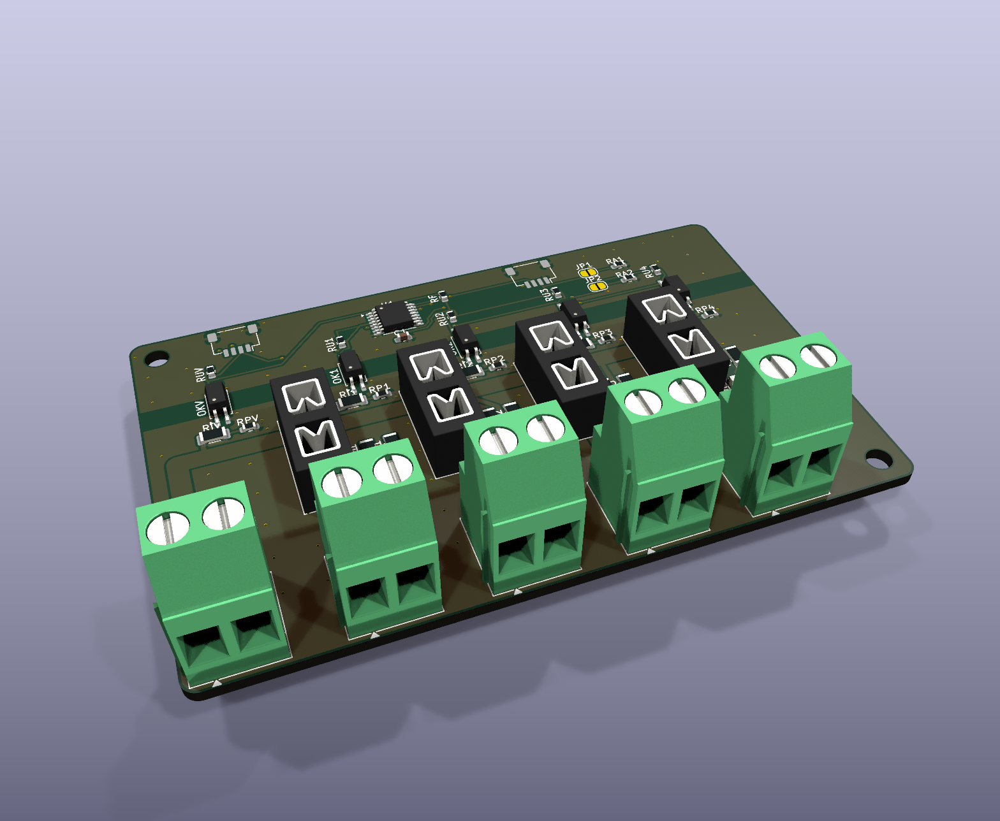

# AP ELECTRIC · AP SIGN DIST 4: distribución DC protegida de 4 ramas

> Parte de la línea **AP SIGN** del ecosistema [AP ELECTRIC](../AP_ELECTRIC.md). Funciona sola, sin programa, o conectada al CORE por **Qwiic** para ver el estado de cada rama en la app y en Home Assistant.

**Para qué sirve:** repartir la fuente de los LED de un letrero en **4 ramas protegidas**, cada una con su fusible:
- letras corpóreas con módulos LED;
- cajas de luz con barras LED;
- neón LED flexible.

Si un tramo hace corto, **solo se apaga esa rama** y el LED rojo dice cuál fue.

> Solo **12-24 V DC** (máximo 26 V), de una fuente certificada. Los portafusibles mini de auto son de 32 V: la red **nunca** se conecta aquí.

## Bornes

| Borne | Qué se conecta |
|---|---|
| `+` `0V` (J1) | Fuente de los LED, **hasta 10 A** en total |
| `R1+ 0V` … `R4+ 0V` | Cada rama: + y 0 V de un grupo de LED |
| Qwiic ENTRA / SIGUE | (opcional) bus de control hacia el CORE y el siguiente módulo |

## Fusibles

| | |
|---|---|
| Tipo | Mini de auto (ATM), en portafusibles Keystone 3568 |
| Por rama | **Hasta 7.5 A**. Elige el fusible según el consumo del tramo, con 25 % de margen. Ejemplo: tramo de 3 A → fusible de 4 o 5 A |
| Total | **10 A**: el tronco de +V es una pista de 2.5 mm en cobre de 2 oz (unos 20 °C sobre el ambiente a 10 A). Para más corriente, usa dos DIST 4 con su propia alimentación |

## LEDs

| LED | Significado |
|---|---|
| **Verde** (V) | La rama tiene voltaje |
| **Rojo** (F) | **Fusible abierto**, con la carga conectada |

Si una rama no tiene carga y su fusible está abierto, el rojo y el verde encienden tenues a la vez. Desconecta esa rama o pon el fusible.

## Aviso al CORE (opcional)

- **Expansor I2C TCA9554, dirección 0x24-0x27:**
  - es el mismo rango que AP INPUT, así que el programa lo ve como un **módulo de entradas**;
  - JP1 cerrado suma 1 y JP2 suma 2;
  - no uses la misma dirección que un AP INPUT.
- **Qué entrada es cada cosa:**

  | Entrada (módulo 0x24) | Significado |
  |---|---|
  | E1-E4 | Rama 1-4 con voltaje |
  | E5 | Fuente presente |
  | E6-E8 | Siempre inactivas |

- **Ponles nombre** con las etiquetas por circuito, por ejemplo `ET E1 Letra A` o `ET E5 Fuente letrero`. Así salen en la app y en Home Assistant.
- **Alarmas:**
  - en Home Assistant, una automatización cuando "Letra A" pasa a apagado y "Fuente letrero" sigue encendido = **fusible abierto**;
  - con reglas: `EA 1 6 3 1` apaga la salida S3 de un AP OUTPUT mientras la rama 1 tenga voltaje y **la enciende cuando la rama se queda sin voltaje**. Ahí va una **baliza de falla**.
- **Aislamiento:** la fuente de los LED (+V y 0 V) queda **aislada** del bus de control:
  - optoacopladores LTV-217;
  - franja de 3.5 mm sin cobre.

  Así las fuentes del letrero quedan separadas del bus de control, como pide la propuesta AP SIGN.

## Pedir en JLCPCB

- 2 capas, **2 oz**, 88 × 56 mm. Archivos en `fabricacion/jlcpcb/` (y en `PEDIDO_JLCPCB/10_AP_SIGN_DIST4`).
- **U1 TCA9554PWR no trae código LCSC:** búscalo por nombre en la revisión de la BOM.
- Bornes y portafusibles se sueldan a mano en el pedido económico.
- Soporte para riel DIN: `ap1-gabinete/din/soporte_din_88x56.stl`.

## Pruebas antes de instalar

1. Alimenta con 24 V sin fusibles: todo apagado. Con el Qwiic conectado, E5 activa y E1-E4 inactivas.
2. Pon fusibles: los 4 verdes encienden y E1-E4 se activan.
3. Rama 1 con una carga de 1 A y fusible de 1 A; luego haz un corto en la rama. Se abre solo F1: el rojo de la rama 1 enciende, E1 se apaga y las otras ramas siguen funcionando.
4. **Calor:** con 10 A en total por 30 min, mide los bornes y las pistas. No deben pasar de unos 60 °C.
