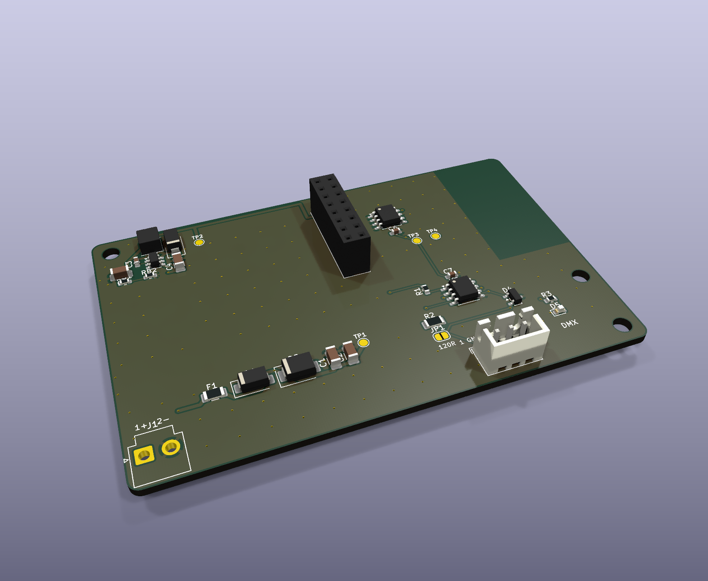

# LetreroLab AP-1 DMX: módulo DMX512

> Parte del [ecosistema AP-1](../ECOSISTEMA.md). Hecho a partir de la [plantilla](../ap1-plantilla/LEEME.md). Usa el mismo **programador**, el mismo **gabinete** y la misma app.

**Para qué sirve:** manejar equipos de iluminación **DMX512**, el estándar de escenarios, fachadas y arquitectura:
- reflectores RGB/RGBW;
- barras de LED;
- decodificadores DMX para tiras LED (muy baratos, de 3 o 4 canales);
- atenuadores DMX de 1 canal.

Con este módulo, el programador AP-1 se vuelve un **controlador DMX con Wi-Fi**: los mismos 10 modos, horarios, app, grupos y Home Assistant, sin consola de iluminación.

## Bornes

| Borne | Señal | Qué se conecta |
|---|---|---|
| **J1** `+ -` | Entrada 12-24 V DC | Fuente certificada (el módulo consume menos de 0.2 A) |
| **J2** `GND D- D+` | Línea DMX | Cable DMX o par trenzado (UTP): **GND** a la malla (pata 1 del XLR), **D-** a la pata 2 y **D+** a la pata 3 |

- **JP1 (terminación de 120 Ω):** en DMX la terminación va en el **último equipo** de la línea. El módulo normalmente queda al **principio**, así que JP1 se deja **abierto**. Ciérralo con una gota de soldadura solo si el módulo queda al final.
- **Cable:** hasta 32 equipos y unos 300 m en una sola línea, conectados en cadena (de un equipo al siguiente, sin derivaciones en estrella). En el último equipo pon un terminador de 120 Ω.
- Para conectores XLR, usa un adaptador de borne a XLR de 3 o 5 patas (pata 1 GND, 2 D-, 3 D+).

## Cómo funciona

- **Se reconoce solo:**
  - el transceptor tiene el receptor siempre encendido, así que regresa por PWM2 el **eco** de lo que se manda;
  - la primera vez, sin medidor de corriente, el programa prueba el eco: si responde, guarda el modelo `LL-DMX`; si no, es un IND;
  - también se puede poner a mano con `MODELO LL-DMX`.
- **Configuración guardada en el módulo:**

| Orden | Qué hace | Ejemplo |
|---|---|---|
| `PD dir canales` | Dirección del primer equipo (1-512) y canales por equipo: **1** atenuador, **3** RGB, **4** RGBW | `PD 1 3` |
| `PX n` | Número de equipos. Se recorta para que quepan en los 512 canales | `PX 8` |
| `PS n` | Grupos para la secuencia (0 = cada equipo es una "letra") | `PS 0` |
| `PO n` | Orden de color: 1 RGB (lo normal en DMX), 0 GRB, 2 BRG | `PO 1` |

  Todo esto también está en la app, en la tarjeta **Módulo DMX512**.
- **Direcciones de los equipos:** con `PD 1 3`, el equipo 1 va en la dirección 1, el 2 en la 4, el 3 en la 7, y así de 3 en 3. Con RGBW (`PD 1 4`): 1, 5, 9…
- **Los mismos 10 modos**, por equipo:
  - FIJO / COLOR: todos del color elegido;
  - SECUENCIA, SEC. SUAVE y ALTERNADO: por equipo o por grupo;
  - ARCOÍRIS: corre a lo largo de los equipos;
  - VELA: cada equipo parpadea distinto.
- **RGBW:** el blanco común de los tres colores se manda al LED blanco (más brillo y mejor blanco).
- **Señal:**
  - DMX512 a 250 kbit/s, 8N2, código de inicio 0 y 512 canales;
  - unos 30 cuadros por segundo con la luz encendida y 2 por segundo apagada (todos los canales en 0);
  - BREAK de 108 µs y MAB de 24 µs (la norma pide al menos 92 y 12 µs).
- **LED verde (D5):** parpadea mientras se transmite. La app muestra cuántos cuadros se han enviado.
- **Home Assistant:** aparece como luz **RGB** con brillo y efectos, igual que el módulo de pixeles.

- **Control en vivo (nodo Art-Net / sACN):** con QLC+ u otra consola por software, el universo que llega por Wi-Fi sale tal cual por la línea DMX. El módulo funciona como un **nodo Art-Net a DMX inalámbrico**. Ver [ECOSISTEMA.md](../ECOSISTEMA.md#control-en-vivo-desde-la-computadora-art-net--sacn).

## Circuito

- **Entrada y fuente de 12 V:** las de la plantilla. Fusible de 3 A, diodo contra polaridad invertida, supresor y LMR16006.
- **U3 SP3485** a 3.3 V:
  - DI = PWM1 (TX de la UART1 del ESP32-C3);
  - RO = PWM2, con 1 kΩ en serie para que no choque con la salida del programador antes de reconocer el módulo;
  - DE = PWM3, con pull-down de 10 kΩ en el programador, así que al arrancar **no transmite**.
- **D4 SM712:** supresor para RS-485 (-7 V / +12 V) en D+ y D-.
- **Sin aislamiento:** la línea DMX comparte GND con la fuente, como la mayoría de los controladores sencillos. Es baja tensión (SELV). Si los equipos tienen su propia fuente en otro tablero, o la línea es larga entre edificios, pon un **divisor/repetidor DMX aislado** después del módulo.

## Pedir en JLCPCB

- 2 capas, 1 oz, 88 × 56 mm. Archivos en `fabricacion/jlcpcb/` (y en `PEDIDO_JLCPCB/7_MODULO_DMX`).
- J1, J2 y J7 se sueldan a mano en el pedido económico.

## Pruebas antes de instalar

1. Sin nada en J2, revisa en la consola del programador: `Eco DMX: si` y modelo `LL-DMX`.
2. Con un decodificador DMX de 3 canales en la dirección 1 y una tira RGB: `PD 1 3`, `PX 1`, `C 255 0 0`. La tira debe verse roja; si se ve de otro color, cambia `PO`.
3. Varios equipos (por ejemplo 4 reflectores en 1, 4, 7 y 10): `PX 4`, modo SECUENCIA. Deben encender uno tras otro.
4. Si un equipo parpadea o se queda en negro, revisa que el último de la línea tenga terminador de 120 Ω y que D+ y D- no estén cruzados.
