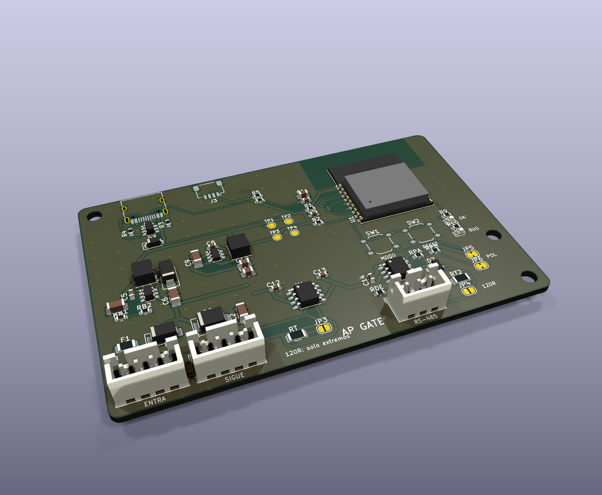

# AP ELECTRIC · AP GATE: pasarela Wi-Fi + AP BUS + RS-485 / Modbus RTU

> Familia **AP GATE** del ecosistema [AP ELECTRIC](../AP_ELECTRIC.md). Es un [AP NODE](../ap1-node/LEEME.md) completo (Wi-Fi, AP BUS, Qwiic) con un puerto **RS-485** para hablar **Modbus RTU** con los equipos industriales que ya hay en la obra.



**Para qué sirve:**
- **Medidores de energía** de riel DIN (por ejemplo, de la familia SDM120/SDM630 o PZEM-016): voltaje, corriente, kW, kWh y factor de potencia.
- **Variadores de frecuencia** de bombas y ventiladores: leer la frecuencia y la corriente del motor; mandar marcha, paro o la frecuencia.
- **PLC**, controladores de temperatura y sensores con salida Modbus.

Las lecturas salen en la app y en **Home Assistant** como sensores, con su nombre.

> Los equipos de red (variadores, medidores) los instala un electricista. La AP GATE solo se conecta a su **puerto de comunicación RS-485**, que es de baja tensión. La red nunca entra a esta placa.

## Conectores

| Conector | Tipo | Qué se conecta |
|---|---|---|
| **J1 / J2** AP BUS | JST XH 4: 1 = +24 V, 2 = CAN_H, 3 = CAN_L, 4 = 0 V | La alimentación de 24 V y el AP BUS (igual que el AP NODE) |
| **J4** RS-485 | JST XH 3: 1 = **A (+)**, 2 = **B (−)**, 3 = 0 V | El bus Modbus. Con par trenzado; la malla del cable a la pata 3 en **un solo extremo** |
| **J3** Qwiic | JST SH 4 | Módulos locales: DO8, AP INPUT, AI4 |
| **J5** USB-C | | Programar y probar en el taller |

**Ojo con A y B.** Algunos fabricantes llaman A al cable negativo (en la norma Modbus son D0 y D1). Si un equipo no responde, **intercambia A y B**: no daña nada.

## Puentes (soldadura)

| Puente | De fábrica | Qué hace |
|---|---|---|
| **JP4** 120R | Abierto | Terminación de 120 Ω del RS-485. Ciérralo si la AP GATE está **en un extremo** del cable (lo normal) |
| **JP5 / JP6** POL | **Cerrados** | Polarización de la línea (560 Ω a 3.3 V y a 0 V): el bus queda en reposo sin falsas tramas. Córtalos solo si otro equipo ya polariza |
| JP3 120R | Abierto | Terminación del AP BUS (CAN), como en el AP NODE |

## Configurar (programa 1.9 o posterior)

1. Graba el programa del CORE (`LetreroLabAP1_completo_0x0.bin`) por USB-C.
2. **Velocidad del bus**, la misma de los equipos (búscala en su menú o manual):
   - `MB 9600 0` para 9600 baudios, 8N1;
   - `MB 9600 1` para paridad par (8E1);
   - 2 = paridad impar (8O1), 3 = 8N2;
   - `MB 0` lo apaga.
   - El equipo se reinicia al cambiarlo.
3. **Puntos de lectura** (hasta 8): `MP n esclavo función registro tipo [escala]`.

| Campo | Valores |
|---|---|
| esclavo | Dirección Modbus del equipo, 1-247 |
| función | **3** = holding registers (40001…), **4** = input registers (30001…) |
| registro | **Desde 0.** El "30001" o "40001" del manual es el **0**; el "30007" es el 6 |
| tipo | 0 = entero de 16 bits sin signo, 1 = con signo, 2 = 32 bits sin signo, 3 = con signo, **4 = float** (32 bits), 5 = float con las palabras invertidas |
| escala | Multiplica el valor. Ejemplo: un variador da la frecuencia en décimas de Hz → escala 0.1 |

4. **Nombre del punto:** `ET M1 Voltaje tablero`.
5. **Escribir:**
   - un registro: `MW esclavo registro valor`;
   - una bobina: `MC esclavo bobina 1|0`.
   - Desde la app, desde Home Assistant (publicando la orden en `letrerolab/<nombre>/cmd`) o en reglas por MQTT.

**Ejemplo, medidor de energía de una fase tipo SDM120 en la dirección 1, configurado a 9600 8E1** (registros float, función 4; revisa el mapa de tu modelo):

```
MB 9600 1
MP 1 1 4 0 4      voltaje (30001)
MP 2 1 4 6 4      corriente (30007)
MP 3 1 4 12 4     potencia activa (30013)
MP 4 1 4 342 4    energía total en kWh (30343)
ET M1 Voltaje
ET M2 Corriente
ET M3 Potencia
ET M4 Energia
```

**Ejemplo, variador en la dirección 3** cuyo manual da la frecuencia de salida en el registro 0x1001 (4097), en décimas de Hz → `MP 5 3 3 4097 0 0.1`. Cada marca usa su propio mapa. Marcha y paro dependen del modelo (palabra de control): búscalo en el manual del variador.

## Cómo funciona

- **Una petición a la vez**, sin detener el programa. Cada punto se lee **una vez por segundo**; las escrituras van primero.
- **Espera** hasta 300 ms la respuesta y revisa la verificación (CRC), la dirección, la función y el largo.
- **Estado de cada punto en la app:** el valor, o "sin respuesta", "error de CRC", "registro no válido" (excepción 2), etc.
- El transceptor SP3485 tiene DE y /RE juntos: se apaga el receptor mientras transmite, así no hay eco.
- **Al arrancar**, DE queda en bajo (10k a 0 V): la pasarela no ocupa la línea mientras inicia.
- Funciona junto con el **AP BUS**: una AP GATE puede ser el maestro del AP BUS (`BUS 1`) y a la vez leer Modbus.

## Límites

| | |
|---|---|
| Velocidad | 1200 a 115200 baudios |
| Equipos | Hasta 32 cargas unitarias en la línea (SP3485); 8 puntos de lectura en el programa |
| Largo | Hasta 1200 m a 9600 baudios, con par trenzado y terminación en los dos extremos |
| Protección | SM712 contra descargas y picos (−7 V / +12 V). **No aislado**: el 0 V del RS-485 es el 0 V de 24 V. Entre edificios o con tierras distintas, pon un repetidor RS-485 aislado |

## Pedir en JLCPCB

- 2 capas, 1 oz, 88 × 56 mm. Archivos en `fabricacion/jlcpcb/` y en `PEDIDO_JLCPCB/13_AP_GATE`.
- Todas las piezas traen código LCSC. El SP3485EN (C8963) es **Basic** y el SM712 (C7420375) es Preferred: no pagan cargo de montaje.
- **Montaje en riel DIN:** `ap1-gabinete/din/soporte_din_88x56.stl`.

## Pruebas antes de instalar

1. Igual que el AP NODE: 24 V en J1; en TP1 ~23.6 V, en TP2 5 V y en TP3 3.3 V.
2. Con JP5/JP6 cerrados y sin equipos, entre A y B: unos 3 V con JP4 abierto y unos 0.3 V con JP4 cerrado (120 Ω). Más de 0.2 V = la línea queda bien en reposo.
3. Con un adaptador USB-RS485 en la PC y un simulador de esclavo Modbus (por ejemplo *ModbusPal* o *diagslave*) en la dirección 1, 9600 8N1:
   - `MB 9600 0`, luego `MP 1 1 3 0 0`;
   - la app debe mostrar el valor del registro 0 y "respuestas bien" debe subir cada segundo.
4. Cambia el esclavo a la dirección 2: el punto debe decir "sin respuesta" y "con falla" sube.
