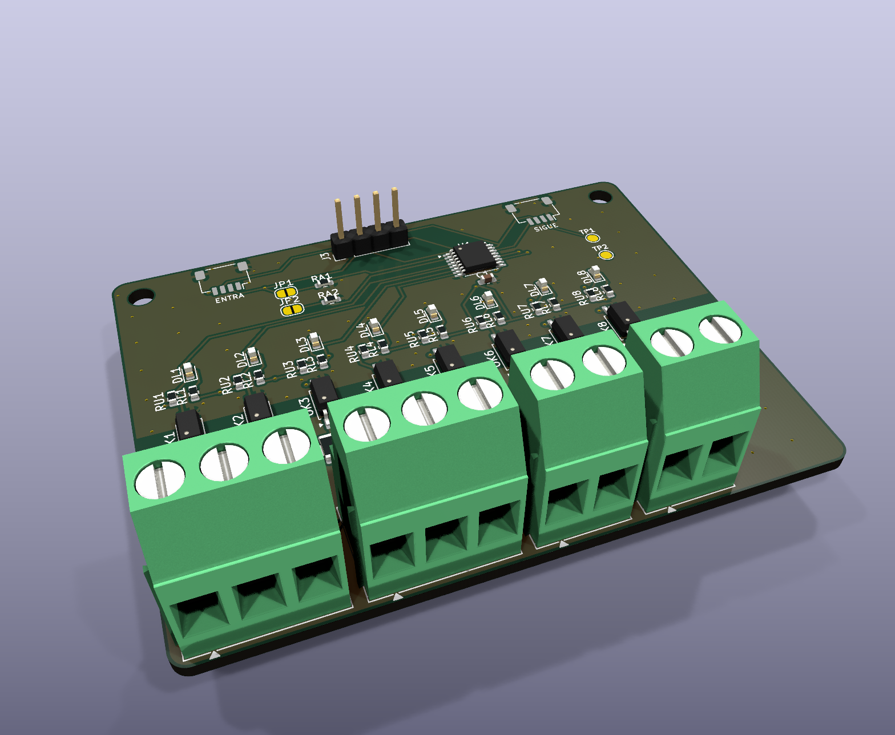

# AP ELECTRIC · AP INPUT: 8 entradas de 12-24 V DC aisladas

> Parte del ecosistema [AP ELECTRIC](../AP_ELECTRIC.md). Se conecta al programador (AP CORE) por el cable **Qwiic**, solo o en cadena con el AP PRO DO8, el AI4 y el DIST 4.



**Para qué sirve:** que el sistema reaccione al mundo físico:
- **pulsadores e interruptores** (encender o apagar la luz, cambiar de escena);
- **sensores** de presencia, fotoceldas y sensores industriales PNP de 3 hilos;
- **flotadores** de cisternas y tinacos;
- **contactos auxiliares** de contactores (confirmar que una bomba arrancó);
- finales de carrera, botones de paro y alarmas.

## Conectores (AP CONNECT, sin borneras)

Un **JST XH de 2 patas por entrada** (E1-E8): un cable por sensor, con seguro, que no entra al revés.

| Pata | Qué se conecta |
|---|---|
| 1 | La señal: +12 a +24 V = activa |
| 2 | Común: el 0 V de la fuente que alimenta ese sensor o contacto (las 8 patas 2 están unidas) |

**Ejemplos de cableado:**
- **Pulsador o contacto seco:** `+24 V` de la fuente → pulsador → `In`; y el `0 V` de esa fuente → `COM`.
- **Sensor PNP de 3 hilos:** café (+24 V) y azul (0 V) a la fuente; negro (salida) → `In`; 0 V de la fuente → `COM`.
- **Contacto auxiliar de contactor (NA):** igual que un pulsador.

**Aislamiento:** el lado de las entradas está **aislado** del programador:
- optoacopladores LTV-217 (3 kV o más, como en el módulo IND);
- franja de 3.5 mm sin cobre en las dos capas.

Por eso los sensores pueden tener su propia fuente. Aun así, **solo se conecta 12-24 V DC**: nunca la red.

## Valores de cada entrada (calculados, por verificar en la primera tanda)

| | |
|---|---|
| Se activa desde | unos **6 V** (las señales débiles o el ruido no la activan) |
| Corriente a 24 V | 4.9 mA (suficiente para limpiar contactos) |
| A 12 V | 1.2 mA por el LED del optoacoplador: funciona, con menos margen |
| Conexión al revés | no se daña (el LED queda con 4.2 V inversos; aguanta 6 V) |
| Rebote | el programa lee cada 20 ms y acepta un cambio cuando 2 lecturas seguidas coinciden |

## Qué hace cada entrada: reglas

Cada entrada tiene una **regla**, que se configura en la app (tarjeta "Entradas y salidas") o con la orden:

```
EA n acción valor [modo]       EA n -   (sin regla)
```

| Acción | Qué hace | Valor |
|---|---|---|
| 0 / 1 | Apagar / encender la luz | — |
| 2 | Salida AUX de la base | 0 o 1 |
| 3 | Escena | 0-3 |
| 4 | Brillo | % |
| 5 / 6 / 7 | Encender / apagar / alternar una **salida del DO8** | número de salida (1-128; S33 en adelante = nodos del AP BUS) |
| 8 | **Alternar la luz** (pulsador de encender y apagar) | — |

- **Modo 0 (al activar):** la acción ocurre una vez, cuando la entrada se activa. Es lo normal en pulsadores.
- **Modo 1 ("mientras"):** al soltar, la entrada hace lo contrario. Ejemplos:
  - **Flotador → bomba:** `EA 2 5 1 1` enciende la salida 1 mientras el flotador esté activo y la apaga al soltar.
  - **Sensor de presencia → luz:** `EA 3 1 0 1` enciende mientras haya presencia.
- **Pulsador de la luz:** `EA 1 8 0`.

Las entradas también aparecen en **Home Assistant** (un sensor por entrada, "Entrada 1"…) y en el estado MQTT. Así una entrada también puede disparar automatizaciones de Home Assistant.

## Direcciones

- **Expansor I2C TCA9554, dirección 0x24-0x27:** JP1 cerrado suma 1 y JP2 suma 2.
- Caben **4 módulos de entradas: E1-E32.** El módulo 0x24 tiene E1-E8, el 0x25 E9-E16, y así. Con nodos [AP NODE](../ap1-node/LEEME.md), E33-E128.
- Las salidas usan 0x20-0x23, así que el programa distingue solo entradas y salidas.
- **Se puede conectar en marcha:** el programa busca módulos cada 5 s.

## Pedir en JLCPCB

- 2 capas, 1 oz, 72 × 56 mm. Archivos en `fabricacion/jlcpcb/` (y en `PEDIDO_JLCPCB/8_AP_INPUT`).
- **U1 TCA9554PWR no trae código LCSC:** búscalo por nombre en la revisión de la BOM.
- Los conectores XH y J3 se sueldan a mano en el pedido económico (o en "ensamble completo"; traen código LCSC).
- **Montaje en riel DIN:** `ap1-gabinete/din/soporte_din_72x56.stl`.

## Pruebas antes de instalar

1. Conecta solo el Qwiic. La consola debe decir `AP INPUT: 01`.
2. Pon 24 V entre `I1` y `COM`: el LED de I1 enciende y la app marca E1.
3. Pon 5 V entre `I1` y `COM`: **no** debe activarse (el umbral es de unos 6 V).
4. Pon 12 V: debe activarse.
5. Conecta 24 V al revés: no debe pasar nada, y al conectarlo bien debe funcionar.
6. Pulsador con `EA 1 8 0`: cada toque enciende o apaga la luz, sin dobles cambios por rebote.
