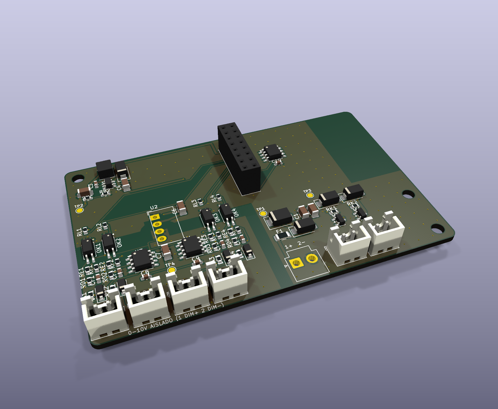

# LetreroLab AP-1 IND: módulo industrial (0-10 V aislado + contactores)

> Parte del [ecosistema AP-1](../ECOSISTEMA.md). Usa el mismo **programador**, el mismo **gabinete** y la misma app que la base universal.

**Para qué sirve:** controlar luces que **no se alimentan directo de la placa**:
- **Naves industriales, bodegas, oficinas:** campanas LED, paneles y reflectores con driver **dimeable 0-10 V o 1-10 V**.
- **Luces de red de 127/240 V** (focos normales, lámparas, letreros con su propia fuente): se encienden y apagan con un **contactor o relevador de estado sólido de riel DIN**.

**La red no entra a esta placa.** La placa solo da la señal 0-10 V y mueve la bobina de 12/24 V del contactor. El contactor y su cableado de 127/240 V los instala un electricista, en un tablero, con su protección.

## Conectores (AP CONNECT, sin borneras; todos al frente)

| Conector | Tipo | Señal | Qué se conecta |
|---|---|---|---|
| **J1** | JST VH 2 patas: 1 = +, 2 = - | Entrada 12-24 V DC (máx. 26 V) | Fuente de riel DIN de 12 o 24 V |
| **K1, K2** (J2, J4) | JST XH 2 patas: 1 = +V, 2 = salida | Bobinas de 2 contactores (0.5 A c/u) | Bobina de 12 V si la fuente es de 12 V; de 24 V si es de 24 V. También sirve un relevador de estado sólido de entrada DC |
| **0-10V 1-4** (J5, J6, J8, J9) | JST XH 2 patas: 1 = DIM+, 2 = DIM- | 4 salidas 0-10 V **aisladas** | DIM+ (morado) y DIM- (gris) de los drivers. Varios drivers en paralelo por canal |

## Cómo funciona

| Mando en la app | Qué pasa |
|---|---|
| Encender o apagar (`P 1` / `P 0`), horarios, sensor de luz | El **contactor 1** cierra o abre la alimentación de las luces |
| Brillo, efectos y escenas de los canales 1-4 | Cada canal da de 0 a 10 V. El programa corrige la curva del filtro: el voltaje sale **proporcional** (simulado: menos de 0.05 V de error y 0.13 V de rizo) |
| Botón "Contactor 2" (`O 100` / `O 0`) | Segundo contactor manual o por horario: un pasillo, el letrero de la fachada, un extractor |
| Home Assistant | Aparece la luz (con brillo y efectos) y el interruptor del contactor 2 |

Al enclavar el programador, el módulo se reconoce solo:
- la primera vez, el programa ve que no hay medidor de corriente y graba el modelo `LL-IND` en la memoria;
- desde ahí usa PWM de 2 kHz (la velocidad que aguantan los optoacopladores) y la curva corregida;
- la app muestra la tarjeta "Módulo industrial".

## Circuito

- **Entrada:** fusible de 3 A, diodo SS34 contra polaridad invertida, supresor SMBJ26A y fuente de 12 V LMR16006 (igual que la base).
- **Aislamiento:** el PWM de cada canal entra a un **optoacoplador LTV-217** (3 kV). Del otro lado, todo se alimenta con un convertidor **B1212S-1WR3** (12 V a 12 V, 1 W, 1.5 kV).
  - Una **franja de 3 mm sin cobre** (en las dos capas) separa el lado de la fuente del lado aislado.
  - Una regla de DRC exige 2.5 mm entre los dos lados. La revisión la cumple.
  - Entre las patas 2 y 3 del convertidor solo quedan 0.8 mm; es la medida del propio módulo y lo cubre su aislamiento interno de 1.5 kV.
- **Salida 0-10 V:** el filtro RC del emisor del optoacoplador (4.7 k / 10 k / 47 k / 1 µF) llega a un seguidor LM358.
  - El LM358 **da y absorbe** corriente, así que sirve para drivers que piden corriente (0-10 V activo) y para los que la entregan (1-10 V).
  - Cada salida tiene 100 Ω y un zener de 12 V contra conexiones equivocadas.
- **Contactores:** MOSFET AO3400A con diodo de rueda libre SS34 a +V. Con 10 k a tierra quedan apagados sin programador.
- **Identidad:** memoria M24C02 con modelo, serie y horas, igual que la base.

## Pedir en JLCPCB

- 2 capas, 1 oz, 88 × 56 mm. Los archivos están en `fabricacion/jlcpcb/`, con la BOM normal y la `_solo_SMD`; los conectores, el zócalo y el convertidor SIP se sueldan a mano.
- Antes de pedir, confirma los códigos LCSC de las piezas Extended:
  - **B1212S-1WR3** (Mornsun, SIP-4). Se puede cambiar por cualquier 12 V a 12 V de 1 W con las mismas patas: 1 −Vin, 2 +Vin, 3 −Vout, 4 +Vout.
  - LMR16006, fusible 1206 y conectores.
- Piezas Basic o Preferred (sin cargo de montaje por tipo): LTV-217-B, LM358DR2G, AO3400A, SS34, SMBJ26A y todos los pasivos.

## Pruebas antes de instalar

1. Sin carga, cada canal al 0, 25, 50, 75 y 100 %: medir de 0 a 10 V entre `n+` y `n-` (±0.5 V).
2. Con un driver real dimeable: atenuar del mínimo al máximo y confirmar que con `P 0` el contactor abre.
3. Aislamiento: con un probador de 500 V DC entre J1(−) y J3(−), más de 100 MΩ.
4. Contactor de 24 V real conectado a K1: que cierre y abra sin rebotes y que el diodo absorba el pico.
