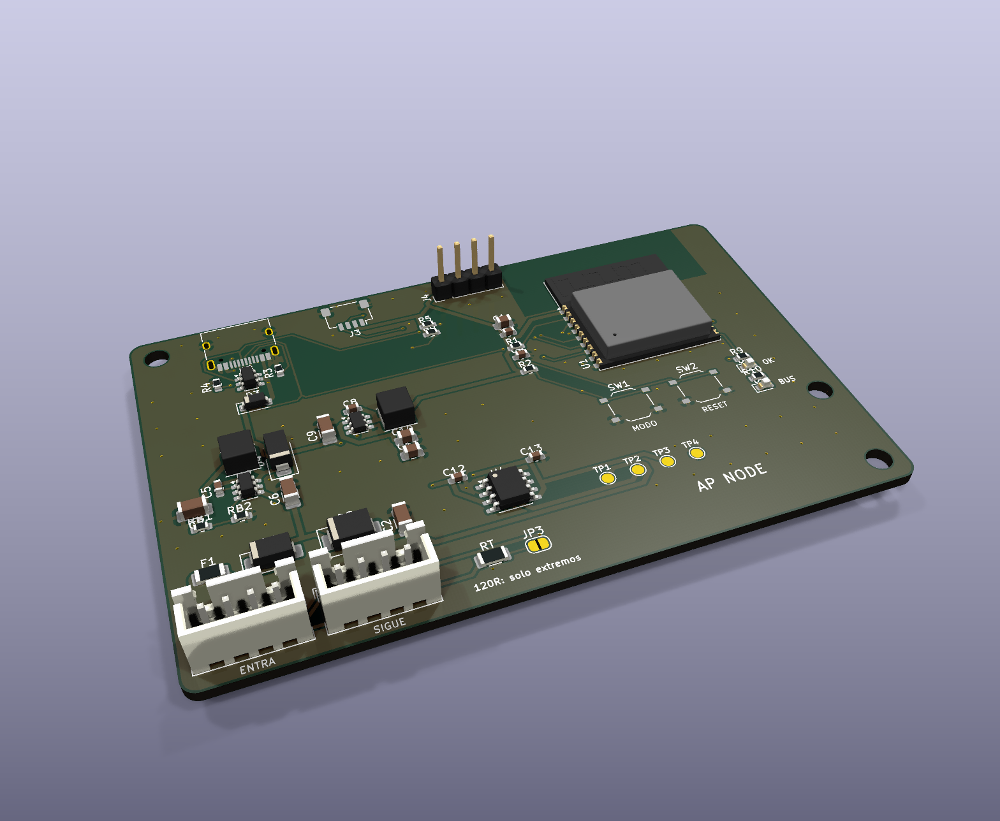

# AP ELECTRIC · AP NODE: nodo remoto del AP BUS (24 V DC + CAN)

> Parte del ecosistema [AP ELECTRIC](../AP_ELECTRIC.md). Especificación del bus en [AP_BUS.md](../AP_BUS.md).



**Para qué sirve:** llevar entradas y salidas **lejos del tablero** (otra planta, la cisterna, la azotea, el otro extremo de una nave) con **un solo cable de 4 hilos**:
- +24 V;
- CAN_H;
- CAN_L;
- 0 V.

En cada punto se pone un AP NODE con sus módulos locales por Qwiic (AP PRO DO8, AP INPUT). El nodo maestro (otro AP NODE en el tablero, con Wi-Fi, la app y Home Assistant) ve esas entradas y salidas como si estuvieran conectadas a él.

```
 Fuente 24 V ── AP NODE maestro ══ cable 4 hilos ══ AP NODE 1 ══ AP NODE 2 ══ AP NODE 3
   (tablero)     + DO8, INPUT        (hasta 250 m)    + DO8        + INPUT      + DO8
                 Wi-Fi, app, HA
```

## Conectores (AP CONNECT)

| Conector | Tipo | Qué se conecta |
|---|---|---|
| **J1** ENTRA | JST XH 4 patas: 1 = +24 V, 2 = CAN_H, 3 = CAN_L, 4 = 0 V | El cable que viene del maestro o del nodo anterior |
| **J2** SIGUE | Igual que J1, unido en la placa | El cable al siguiente nodo |
| **J3** Qwiic | JST SH 4 patas | Módulos locales: DO8, AP INPUT, AI4, DIST 4 |
| **J4** EXT | Macho 1×4 de 2.54 mm: 3V3, IO6, IO7, 0 V | Libre: sensor 1-wire, botón externo |
| **J5** USB-C | | Programar y probar en el taller (alimenta el nodo sin bus) |

## Circuito

| Bloque | Pieza | Detalle |
|---|---|---|
| Entrada del nodo | Fusible 3 A (1206), diodo SS34 en serie, supresor SMBJ26A | Polaridad invertida y picos. El fusible protege al nodo, no al cable que pasa a J2 |
| 5 V | LMR16006 (60 V) | Para el transceptor CAN |
| 3.3 V | AP63203 (2 A, síncrono) | ESP32 y módulos Qwiic |
| CAN | **TJA1051T/3** (NXP) | 5 V en el bus y lógica a 3.3 V (pata VIO). TXD con pull-up interno: el bus no se bloquea mientras arranca el ESP32 |
| Terminación | 120 Ω + puente JP3 | **Cerrar solo en los dos extremos del cable** (el maestro y el último nodo) |
| Cerebro | ESP32-C3-WROOM-02 | Controlador CAN interno (TWAI): IO4 = TX, IO5 = RX. I2C en IO2/IO8 |
| LEDs | OK (IO21) y BUS (IO10) | BUS fijo = hay tráfico; BUS rápido = nadie responde |

## Configurar (programa 1.8 o posterior)

1. Graba el mismo programa del CORE (`LetreroLabAP1_completo_0x0.bin`) por USB-C.
2. En la consola o en la app → Ajustes → orden:
   - **Maestro** (el del tablero): `BUS 1`.
   - **Nodos remotos:** `BUS 2 1`, `BUS 2 2`, `BUS 2 3` (un número distinto por nodo).
   - `BUS 0` lo apaga.
   - El equipo se reinicia al cambiarlo.
3. **Numeración en el maestro:**

| Nodo | Salidas (DO8 0x20-0x23) | Entradas (AP INPUT 0x24-0x27) |
|---|---|---|
| Maestro (local) | S1-S32 | E1-E32 |
| Nodo 1 | S33-S64 | E33-E64 |
| Nodo 2 | S65-S96 | E65-E96 |
| Nodo 3 | S97-S128 | E97-E128 |

4. Reglas, horarios, etiquetas y Home Assistant **se configuran en el maestro**. Ejemplo: el flotador de la cisterna en E33 (nodo 1) enciende la bomba en S65 (nodo 2): `EA 33 5 65 1`.

## Falla segura

- Si un nodo pasa **1 s sin órdenes del maestro** (cable cortado, maestro apagado), **apaga todas sus salidas**. Vuelven en cuanto regresa el maestro.
- Si el maestro deja de oír a un nodo, sus entradas y salidas desaparecen de la app y de Home Assistant.
- **Aun así**, una bomba o una válvula que no debe quedarse encendida necesita su límite propio (flotador, temporizador del contactor).

## Límites

| | |
|---|---|
| Velocidad | 250 kbit/s |
| Largo del cable | hasta **250 m** en total. Cada derivación a un nodo: menos de 1 m (se entra y se sale del nodo con J1 y J2) |
| Nodos | 1 maestro + 3 remotos (el protocolo admite más; el programa usa 3) |
| Corriente por el cable | **3 A** (conector XH). Cuenta la caída: con cable de 0.5 mm² (36 mΩ/m por hilo) y 1 A a 100 m caen 7.2 V. Para cargas grandes, pon una fuente de 24 V en el nodo y **une solo el 0 V** |
| Cable | Par trenzado para CAN_H/CAN_L. Con **UTP de red** (Cat 5e): un par para CAN, un par unido para +24 V y otro para 0 V; así aguanta ~1 A, solo para los nodos y sus bobinas pequeñas. Para más corriente, cable de 2 × 0.75 mm² aparte para la alimentación |

## Pedir en JLCPCB

- 2 capas, 1 oz, 88 × 56 mm. Archivos en `fabricacion/jlcpcb/` (y en `PEDIDO_JLCPCB/12_AP_NODE`).
- Todas las piezas traen código LCSC (TJA1051T/3 C38695, LMR16006 C87080, AP63203 C780769, ESP32-C3-WROOM-02 C2934560).
- **Montaje en riel DIN:** `ap1-gabinete/din/soporte_din_88x56.stl`.

## Pruebas antes de instalar

1. Solo USB-C: el LED OK parpadea y aparece la red de configuración, como en el CORE.
2. 24 V por J1 (sin USB): en TP1 ~23.6 V (después del diodo), en TP2 5.0 V y en TP3 3.3 V.
3. Dos nodos en la mesa con 1 m de cable, JP3 cerrado en ambos: `BUS 1` en uno y `BUS 2 1` en el otro. El LED BUS queda fijo en los dos y la app del maestro dice "nodos en línea: 1".
4. DO8 en el nodo 1: `SA 33 1` en el maestro enciende su S1.
5. Desconecta el cable con S33 encendida: en 1 s se apaga y la app del nodo dice "SIN MAESTRO".
