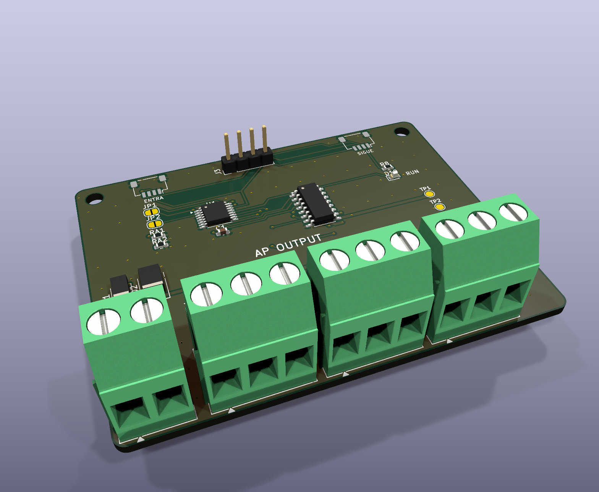

# AP ELECTRIC · AP OUTPUT: 7 salidas de 24 V DC

> Parte del ecosistema [AP ELECTRIC](../AP_ELECTRIC.md). Se conecta al programador (AP CORE) por el cable **Qwiic**. No hay que cambiar la base ni el programador.

**Para qué sirve:** mandar cargas de 24 V DC desde horarios, entradas, la app o Home Assistant:
- bobinas de **contactores** y relevadores de interfaz de riel DIN, para bombas, motores y luces de red;
- **electroválvulas** de 24 V DC, por ejemplo de riego;
- sirenas, balizas y lámparas piloto.

> La red de 127/220 V **no entra a esta placa**. Bombas, motores y luces de red se encienden con un contactor o relevador de estado sólido de riel DIN certificado, instalado por un electricista. Esta placa solo mueve su bobina de 24 V DC.

## Bornes

| Borne | Qué se conecta |
|---|---|
| `+24` `0V` (J4) | Fuente de 24 V DC. **La misma fuente que alimenta la base**: el 0 V es la tierra del programador |
| `Q1` … `Q7` | Un lado de cada carga. La salida conecta a 0 V cuando está activa |
| `+24` `+24` (J7) | El otro lado de las cargas (+24 V, después del fusible) |

**Cableado de una carga:** `+24` → bobina o válvula → `Qn`. Los diodos para bobinas ya vienen dentro del ULN2003: no hace falta poner diodos en las bobinas.

## Límites (verificados con la hoja del ULN2003)

| | |
|---|---|
| Tensión de las cargas | 12-24 V DC (máximo 26 V; el ULN2003 aguanta 50 V) |
| Corriente por salida | **300 mA** (a 3.3 V de mando) |
| Corriente total | **700 mA** al mismo tiempo, por el calor del ULN2003 (unos 1.1 V de caída por salida) |
| Fusible general | 3 A (protege el cableado; las salidas **no** tienen protección contra cortos) |

- Una bobina de contactor de 24 V DC de 3 W consume 125 mA. Una válvula de riego de 24 V DC suele consumir 150-300 mA.
- **Para más corriente**, pon un relevador de interfaz de riel DIN: su bobina consume unos 20 mA.

## Cómo funciona

- **Expansor I2C TCA9554, dirección 0x20-0x23:**
  - JP1 cerrado suma 1 y JP2 suma 2. Así caben **4 módulos de salidas: S1-S28**. El módulo 0x20 tiene S1-S7, el 0x21 S8-S14, y así.
  - **Al encender, ninguna salida se activa:** el expansor arranca con todas sus patas como entradas y el programa apaga todo antes de usarlas.
- **LED RUN:** parpadea mientras el programa está al mando.
- **LED por salida:** encendido = salida activa.
- **Órdenes:**
  - `SA n 1` enciende la salida n, `SA n 0` la apaga y `SA n 2` la alterna;
  - en los **horarios**, acciones 5 (encender salida), 6 (apagar salida) y 7 (alternar salida), con la salida como valor;
  - las **entradas** de AP INPUT pueden mandar cualquier salida (ver [AP INPUT](../ap1-in/LEEME.md)).
- **App:** tarjeta "Entradas y salidas", con un botón por salida.
- **Home Assistant:** un interruptor por salida ("Salida 1"…).
- **Se puede conectar en marcha:** el programa busca módulos cada 5 s.
- **Si el programador se reinicia o pierde la conexión**, las salidas se quedan como estaban hasta que el programa vuelva a escribirlas. Si una válvula o bomba **no debe quedarse encendida**, ponle un límite de tiempo propio, como un flotador o un temporizador del contactor.

## Pedir en JLCPCB

- 2 capas, 1 oz, 72 × 56 mm. Archivos en `fabricacion/jlcpcb/` (y en `PEDIDO_JLCPCB/9_AP_OUTPUT`).
- **U1 TCA9554PWR no trae código LCSC** (no se pudo consultar el catálogo desde aquí). En la revisión de la BOM de JLCPCB, búscalo por nombre (`TCA9554PWR`, TSSOP-16) y elige uno en existencia.
- Los bornes y J3 se sueldan a mano en el pedido económico.
- **Montaje en riel DIN:** soporte imprimible `ap1-gabinete/din/soporte_din_72x56.stl`.

## Pruebas antes de instalar

1. Conecta solo el cable Qwiic y 24 V. La consola debe decir `AP OUTPUT: 01` y el LED RUN debe parpadear.
2. `SA 1 1`: el LED de Q1 enciende, y entre `+24` y `Q1` se miden unos 23 V.
3. Con una bobina de contactor real en Q1: enciende y apaga 20 veces; el ULN2003 debe quedar tibio, no caliente.
4. Desconecta el Qwiic con Q1 encendida y vuelve a conectarlo: Q1 debe seguir como el programa la tiene.
