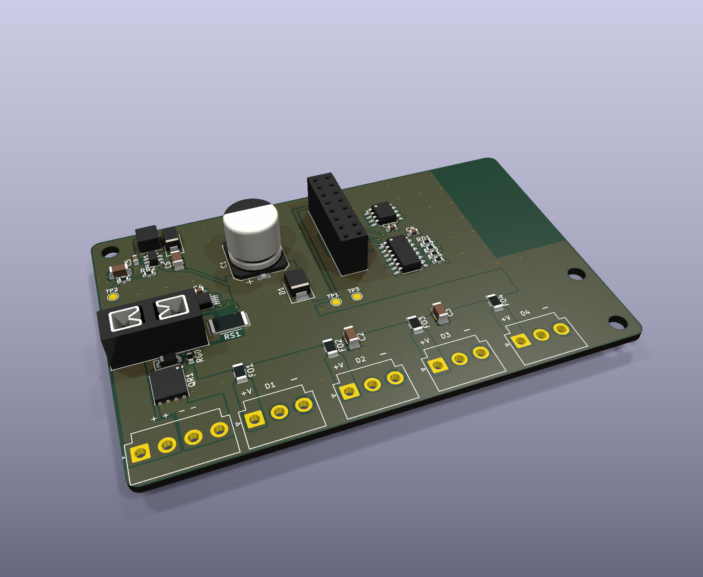

# LetreroLab AP-1 PIX: módulo de pixeles direccionables

> Parte del [ecosistema AP-1](../ECOSISTEMA.md). Usa el mismo **programador**, el mismo **gabinete** y la misma app que la base universal.

**Para qué sirve:** letreros y tiras de **pixeles direccionables**, donde cada LED tiene su propio color:
- letras que se encienden en secuencia;
- arcoíris que corre y efectos de color;
- marquesinas y fachadas.

Funciona con **WS2812B, SK6812 (RGB), WS2813 y WS2815**, de 5, 12 o 24 V.

## Conectores (AP CONNECT, sin borneras; todos al frente)

| Conector | Tipo | Señal | Qué se conecta |
|---|---|---|---|
| **J1** | JST VH 4 patas: 1-2 = +, 3-4 = - (10 A por pata) | Entrada 5-24 V DC, hasta 15 A | Fuente del **mismo voltaje que las tiras** (2 hilos de + y 2 de -) |
| **J2-J5** | JST VH 3 patas: 1 +V, 2 DATOS, 3 GND | 4 salidas de pixeles | **+V** de la tira (fusible de 3 A), **DATOS** (DIN de la tira) y **GND** |

**Tiras largas o de mucho consumo:**
- cada salida tiene un fusible de 3 A, que alcanza para unos 50 LED de 5 V en blanco total, o 1-2 m de tira de 12/24 V;
- para más, **inyecta +V y GND directo de la fuente** a la tira, en el inicio y cada 2-3 m;
- desde la placa solo van **DATOS y GND**;
- el límite de corriente total (`J n`) sigue cuidando la fuente.

## Cómo funciona

- **Se reconoce solo:** la memoria del módulo dice `LL-PIX`. Un módulo nuevo se identifica porque tiene medidor de corriente pero no sensor de temperatura.
- **Configuración guardada en el módulo:** la configuración viaja con el letrero, no con el programador.
  - `PX 120 80 0 0`: LED por salida (0-600). Si una salida tiene 0, no se usa.
  - `PS 5`: número de **letras o segmentos**. Toda la cadena (salida 1, luego 2, 3 y 4) se divide en partes iguales. Con 0, cada salida es una parte.
  - `PO 0`: orden de color: 0 GRB (WS2812B), 1 RGB, 2 BRG.
- **Los mismos 10 modos de siempre**, ahora por pixel:

| Modo | En pixeles |
|---|---|
| FIJO / COLOR | Toda la tira del color elegido (`C r g b`); si el color es negro, blanco |
| SECUENCIA | Se enciende una letra a la vez |
| SEC. SUAVE | Las letras se encienden y apagan en ola |
| ALTERNADO | Letras pares e impares alternan |
| ARCOÍRIS | Arcoíris que corre a lo largo de la cadena |
| PARPADEO, RESPIRAR, FLASH | Toda la tira |
| VELA | Cada LED parpadea distinto |

- **Brillo limitado por corriente medida:** el INA238 mide la corriente total.
  - Si pasa del 90 % del límite (`J n`), el programa baja el brillo hasta que se cumpla, como el "ABL" de WLED, pero con la corriente real.
  - La app avisa cuando está limitando.
- **Velocidad:** 30 cuadros por segundo. El ESP32-C3 tiene 2 canales RMT de salida, así que las 4 salidas se mandan una tras otra; con 300 LED por salida son unos 36 ms por cuadro (unos 27 cuadros por segundo).
- **Home Assistant:** la luz aparece con **color RGB**, brillo y efectos, más los sensores de voltaje, corriente, potencia y energía.

- **Control en vivo:** también se puede animar desde **xLights**, Jinx! o Resolume por Art-Net / sACN (170 LED por universo). Ver [ECOSISTEMA.md](../ECOSISTEMA.md#control-en-vivo-desde-la-computadora-art-net--sacn).

## Circuito

- **Entrada:** los mismos bloques probados de la base.
  - Fusible mini de auto.
  - MOSFET contra polaridad invertida (BSC028N06LS3, de nivel lógico, así que conduce bien desde 5 V).
  - Supresor SMBJ26A.
  - Medidor INA238 con shunt Kelvin de 1 mΩ.
  - 330 µF para los picos de corriente de los pixeles.
- **Datos:**
  - Del programador sale PWM 1-4 a 3.3 V.
  - Un **74HCT125** (entradas TTL, alimentado a 5 V) da una señal limpia de 5 V.
  - 100 Ω en serie por salida.
  - Las resistencias de 10 k del programador mantienen los datos en bajo al arrancar: las tiras no parpadean al encender.
- **Fuente de 5 V** para el buffer (LMR16006). Con entrada de 5 V pasa casi directo (el buffer aguanta de 4.5 a 5.5 V).
- **Programador:** toma la entrada directa por el zócalo (acepta 5-26 V).

## Pedir en JLCPCB

- 2 capas, **2 oz**, 88 × 56 mm. Los archivos están en `fabricacion/jlcpcb/`, con la BOM normal y la `_solo_SMD`.
- Conectores, zócalo y portafusible se sueldan a mano en el pedido económico (traen código LCSC).

## Pruebas antes de instalar

1. Con 60 LED WS2812B en la salida 1 (`PX 60 0 0 0`): probar los 10 modos.
2. `PO`: confirmar el orden de color con `C 255 0 0` (debe verse rojo).
3. Límite: `J 2` con la tira en blanco al 100 %. El brillo debe bajar solo hasta unos 1.8 A.
4. Las 4 salidas a la vez, 300 LED cada una, con Wi-Fi activo: revisar que no haya parpadeos (el C3 manda por RMT; si los hubiera, bajar a 200 LED por salida).
