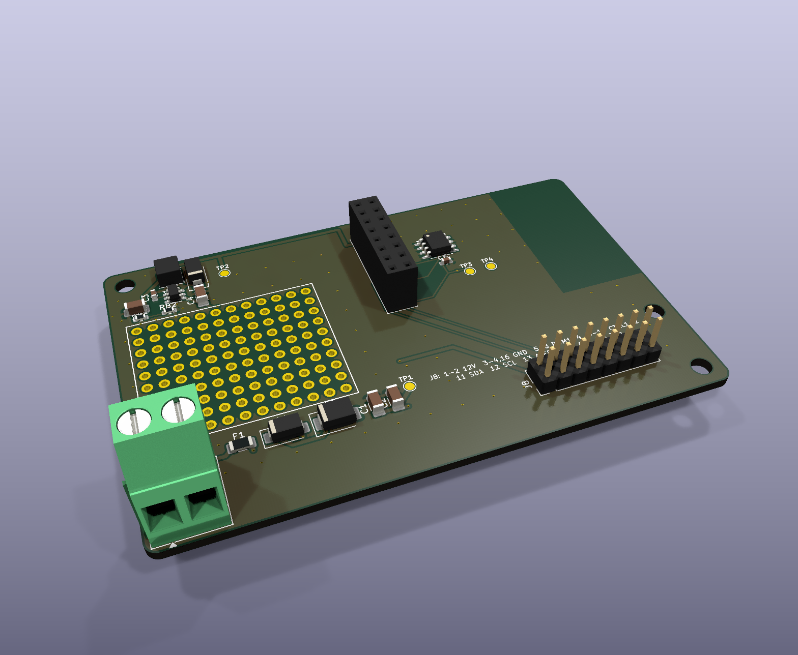

# LetreroLab AP-1 PLANTILLA: la base para módulos nuevos

> Parte del [ecosistema AP-1](../ECOSISTEMA.md). Sirve para **probar ideas** con el programador real y para **empezar el diseño** de cualquier módulo nuevo (DALI, RS-485, CC 60 V, sensores…).



## Qué trae

Todo lo que cualquier módulo del ecosistema necesita, ya revisado: ERC 0, DRC 0 y reglas de JLCPCB.

| Bloque | Piezas | Para qué |
|---|---|---|
| Medida y agujeros | 88 × 56 mm, M3 en (3.5, 3.5), (84.5, 39.5) y (84.5, 52.5) | Entra en el gabinete `ap1-gabinete` y acepta el programador encima |
| **J7** zócalo 2×8 en (47, 6) | Conector LL | El programador se enclava aquí |
| Zona sin cobre | x 72.5-88, y 0-30.5 | Bajo la antena Wi-Fi del programador |
| **Entrada protegida** 12-24 V | J1, F1 (3 A), D1 (SS34 en serie), D2 (SMBJ26A), C1-C2 | Fusible, polaridad invertida y picos |
| **Fuente de 12 V** | U2 LMR16006, L1, D3, C3-C5, RB1-RB2 | Alimenta al programador por las patas 1-2 de J7 (igual que la base) |
| **Memoria de identidad** | U1 M24C02 (I2C 0x50) | El programador lee el modelo del módulo |
| **J8** macho 2×8 | Las **mismas 16 señales** que J7 | Cablear prototipos con cable dupont o IDC |
| **Área de prototipos** | 12 × 10 agujeros metalizados a 2.54 mm | Como una placa perforada |
| Puntos de prueba | TP1 VIN, TP2 12 V, TP3 3.3 V, TP4 GND | Medir con el multímetro |

**Seguridad:** igual que todo el ecosistema, solo entra **12-24 V DC** (máximo 26 V) de una fuente certificada. **Nunca** se conecta tensión de red al área de prototipos.

### J8 (y J7): conector LL

| Pata | Señal | Pata | Señal |
|---|---|---|---|
| 1, 2 | +12 V (sale de la placa, máx. 0.5 A en total) | 3, 4, 16 | GND |
| 5-8 | PWM 1-4 (3.3 V desde el programador) | 9, 10 | CTRL 1-2 (salidas lógicas de 3.3 V) |
| 11, 12 | SDA, SCL (I2C, ya con resistencias en el programador) | 13 | ALERTA (entrada al programador, activa en bajo) |
| 14 | AUX (salida lógica de 3.3 V) | 15 | 3.3 V del programador (máx. 200 mA para tus circuitos) |

## Uso 1: probar una idea sin diseñar placa

1. Pide la plantilla armada (carpeta `6_PLANTILLA` del pedido) y suelda J1, J7 y J8 a mano.
2. Enclava el programador en J7 y alimenta J1 con 12 o 24 V.
3. En la app (o por consola) escribe **`MODELO LL-PROTO`**. Con un nombre que no empieza con `LL-IND` ni `LL-PIX`, el programa usa el **modo general**:
   - PWM 1-4: los 10 modos de luz (PWM de 19.5 kHz);
   - CTRL 1-2: los "focos CC" de la app;
   - AUX: el relevador de la app.
4. Arma tu circuito en el área de prototipos y toma las señales de J8.

Ejemplos de lo que se puede probar:
- un sensor I2C nuevo en SDA/SCL;
- un MOSFET o un driver con PWM 1;
- un transceptor RS-485 o DALI con CTRL 1-2 y AUX.

## Uso 2: diseñar un módulo nuevo

Todo se genera con código (`tools/placa.py`). No se dibuja a mano.

1. **Copia la carpeta**: `cp -r ap1-plantilla ap1-dali` y borra `kicad/` y `fabricacion/` de la copia.
2. En `gen/make.py`:
   - cambia `PROJECT` (p. ej. `AP1_DALI`);
   - cambia `NS` y `ROOT_UUID` por uuid nuevos (`python3 -c "import uuid; print(uuid.uuid4())"`);
   - cambia `TITLE`, `SUBTITLES` y los textos de `SILK`.
3. **Agrega tus piezas** a la lista `C_`. Cada pieza es una tupla:
   ```python
   ("Q1", "AO3400A", "Device:Q_NMOS_GSD", "Package_TO_SOT_SMD:SOT-23", {"1": "PWM1", "2": "GND", "3": "SAL1"}, "Salida 1"),
   #  ref   valor       símbolo de KiCad      huella de KiCad             {pata: red}                                 función
   ```
   - Usa símbolos y huellas de las librerías estándar de KiCad 9 o de `tools/huellas/LetreroLab.pretty`.
   - Las redes del conector LL ya existen: `PWM1-4`, `CC1`, `CC2`, `SDA`, `SCL`, `ALERT`, `AUX`, `3V3`, `V12`, `VIN`, `GND`.
4. **Ponle posición** a cada pieza en `POS`: `"Q1": (x, y, giro)` en mm, origen arriba a la izquierda.
   - Revisa que no se encimen: `python3 gen/make.py --cajas` lista el rectángulo de cada pieza.
   - Deja libres J7, los agujeros y la zona de la antena.
5. **Quita lo que no uses**: J8 y su texto, `SOLO_PLACA` (área de prototipos) y los puntos de prueba.
6. **Pistas anchas** para corriente: agrega las redes a `NETCLASS` (`"Media"` 0.6 mm; crea otra clase con más ancho si hace falta). Para cobre grande usa `POWER_ZONES` (mira `ap1-base/gen/make.py`).
7. **Rutea y revisa** (desde `hardware/`, con KiCad 9 en el contenedor `kc`):
   ```bash
   bash tools/rutear.sh ap1-dali AP1_DALI      # Freerouting + planos + ERC/DRC
   ```
   Debe terminar con **0 violaciones** de ERC y DRC.
8. **Archivos de fabricación**:
   ```bash
   docker exec -w /work/hardware kc python3 tools/salidas.py ap1-dali AP1_DALI
   ```
   - Crea `fabricacion/jlcpcb/` (Gerber, BOM, CPL y resumen de costo) y `fabricacion/3d/` (renders y STEP).
   - Si alguna pieza sale **sin código LCSC**, agrégalo a `CONOCIDOS` en `tools/jlcpcb.py`, o a `POR_HUELLA` si es un conector.
9. Agrega la placa a `tools/pedido_jlcpcb.sh` y a la tabla de `PEDIDO_JLCPCB.md`.

## Uso 3: que el programa reconozca el módulo nuevo

El programa (`ap1-prog/firmware/LetreroLabAP1/LetreroLabAP1.ino`) elige el modo por el **modelo** guardado en la memoria del módulo. Así se hicieron los módulos IND y PIX; copia el mismo patrón:

1. **Bandera del modo**, junto a `modoInd` y `modoPix`:
   ```cpp
   bool modoDali = false;   // módulo AP-1 DALI
   ```
2. **Detectarlo** en `leerBase()` y en la orden `MODELO` (las dos líneas `modoInd = !strncmp(...)`):
   ```cpp
   modoDali = !strncmp(baseModelo, "LL-DALI", 7);
   ```
   - El modelo se escribe una vez con `MODELO LL-DALI` y viaja con el módulo.
   - Si quieres que se detecte solo, agrega en `leerBase()` la pieza I2C que lo distinga, como `hayINA` y `hayTMP`.
3. **Comportamiento** en `loop()`, junto a `efectos(t)` y `pixEnviar(t)`, y en `pwm()`:
   - qué hacer con los 4 PWM (como `linealInd` del IND o `pixEnviar` del PIX);
   - qué hacer con CTRL 1-2 y AUX.
4. **Estado y app**:
   - en el JSON de estado agrega `",\"dali\":"` (junto a `"ind"` y `"px"`);
   - en `pagina.h` agrega una tarjeta `<div class="card" id="tdali" style="display:none">` y muéstrala con `E.dali`, igual que `tind` y `tpix`.
5. **Home Assistant**: en `haPublicar()` quita las entidades que no apliquen (como hace `if (!modoPix)`) y agrega las nuevas con `haUno(...)`.
6. Compila: `bash tools/compilar_esp32.sh ap1` (o con Arduino IDE, ver `LEEME_PC.md`).

## Pedir en JLCPCB

- 2 capas, 1 oz, 88 × 56 mm. Archivos en `fabricacion/jlcpcb/` (y en `PEDIDO_JLCPCB/6_PLANTILLA`).
- J1, J7 y J8 se sueldan a mano en el pedido económico.
