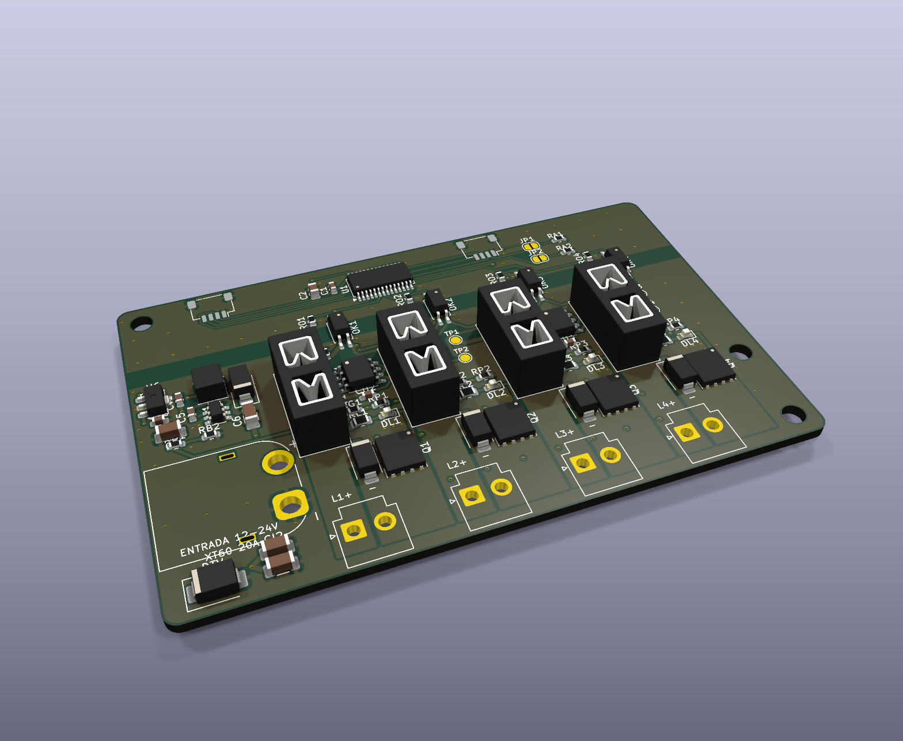

# AP ELECTRIC · AP LIGHT PWM4: 4 canales de 12-24 V DC atenuables, 6 A cada uno, aislados

> Línea **AP LIGHT** del ecosistema [AP ELECTRIC](../AP_ELECTRIC.md). Se conecta al CORE (o a un AP NODE / AP GATE) por **Qwiic**. Con 4 PWM4 un CORE maneja **16 canales de potencia**.

**Para qué sirve:** cargas de 12-24 V DC grandes, con atenuación de 0 a 100 %:
- luminarias LED de 24 V: reflectores, luminarias de estacionamiento y de bodega, lámparas lineales;
- tiras de alta potencia y letras corpóreas grandes;
- ventiladores y extractores de 12-24 V DC (velocidad), calefactores de 24 V.

## Conectores

| Conector | Tipo | Qué se conecta |
|---|---|---|
| **J1** ENTRADA | **XT60** (hasta **20 A**) | La fuente de las luminarias, de 12 a 24 V DC. Polaridad marcada en el conector |
| **J2-J5** L1-L4 | JST VH 2: **1 = +V** (con fusible), **2 = − conmutado** | Cada luminaria o grupo, con su propio cable de 2 hilos |
| J6 / J7 | Qwiic | Bus I2C del CORE / al siguiente módulo |

## Por qué es "superior"

| | |
|---|---|
| **Aislado** | El 0 V de la fuente de potencia **no se une** al del bus: cada canal cruza por un optoacoplador y hay una franja de 3.5 mm sin cobre. Los 20 A nunca pueden regresar por el cable Qwiic al CORE, aunque se afloje un negativo |
| **Fusible por canal** | Mini de auto de hasta 7.5 A: un corto en una luminaria solo abre su fusible |
| **MOSFET de 2.8 mΩ** | BSC028N06LS3 con driver UCC27524 a 12 V: a 6 A se calienta **0.1 W** |
| **4 capas** | Planos internos de +V y 0 V (solo en el lado de potencia), 2 oz por fuera |
| **Diodo de rueda libre** | SS34 por canal: cables largos y ventiladores sin picos |
| **Supresor** | SMBJ26A en la entrada |
| **LED por canal** | Encendido = canal activo |

## Límites

| | |
|---|---|
| Tensión | 12-24 V DC (máximo 26 V por el supresor) |
| Por canal | **6 A** continuos (fusible de 7.5 A) |
| Total | **20 A** (XT60) |
| PWM | 508 Hz, 12 bits, con curva de brillo para el ojo. Sin parpadeo visible |
| Motores | Ventiladores hasta 3 A (por el diodo SS34). Motores mayores: variador o relevador |

## Programa (2.0 o posterior)

- **Dirección I2C:** 0x41 de fábrica; JP1 suma 2 y JP2 suma 16 → **0x41, 0x43, 0x51, 0x53** (4 módulos = L1-L16).
- **Órdenes:**

| Orden | Qué hace |
|---|---|
| `LU 1 75` | L1 al 75 % |
| `LO 1 0` / `LO 1 1` / `LO 1 2` | Apagar, encender (al último nivel), alternar |
| `LS 1 1` | L1 **sigue a la luz principal**: encendido, brillo, horarios, "solo de noche" y escenas de brillo |
| `LR 2` | Rampa de 2 s al encender, apagar y cambiar de nivel |
| `ET L1 Fachada` | Nombre en la app y en Home Assistant |

- **Horarios, entradas, umbrales:** acciones 9/10/11 con el número de la luminaria.
- **Horario solar:** con `GEO lat lon`, encender al ocaso y apagar al amanecer (ver [AO4](../ap1-ao4/LEEME.md)).
- **Home Assistant:** una luz atenuable por canal.
- **Al encender o reiniciar el CORE:** todo apagado. El PCA9685 arranca con sus salidas en 0 y cada canal tiene resistencias a 0 V antes y después del opto.

## Pedir en JLCPCB

- **4 capas**, 1.6 mm, **2 oz exteriores** / 1 oz interiores, 88 × 56 mm. Archivos en `PEDIDO_JLCPCB/14_AP_LIGHT_PWM4`.
- Todas las piezas traen código LCSC (PCA9685PW C2678753, BSC028N06LS3 C534316, UCC27524D C465729, LTV-217 C115450).
- Los portafusibles, el XT60 y los VH se sueldan a mano en el pedido económico.
- Soporte DIN: `ap1-gabinete/din/soporte_din_88x56.stl`.

## Pruebas antes de instalar

1. **Aislamiento:** sin nada conectado, entre el 0 V del XT60 y el 0 V del Qwiic (pata 1) el multímetro debe marcar **circuito abierto**.
2. Fuente de 24 V limitada a 1 A en el XT60, sin Qwiic: ningún LED de canal enciende. En TP2 hay 12 V y en TP3 5 V.
3. Qwiic al CORE: la consola dice `AP LIGHT: 01` y la app muestra L1-L4.
4. Con una tira de prueba en L1: `LU 1 10`, `LU 1 50`, `LU 1 100`. Sube suave, sin parpadeo.
5. **Carga real:** 6 A en un canal por 30 min. El MOSFET y el portafusibles deben quedar a menos de 60 °C.
