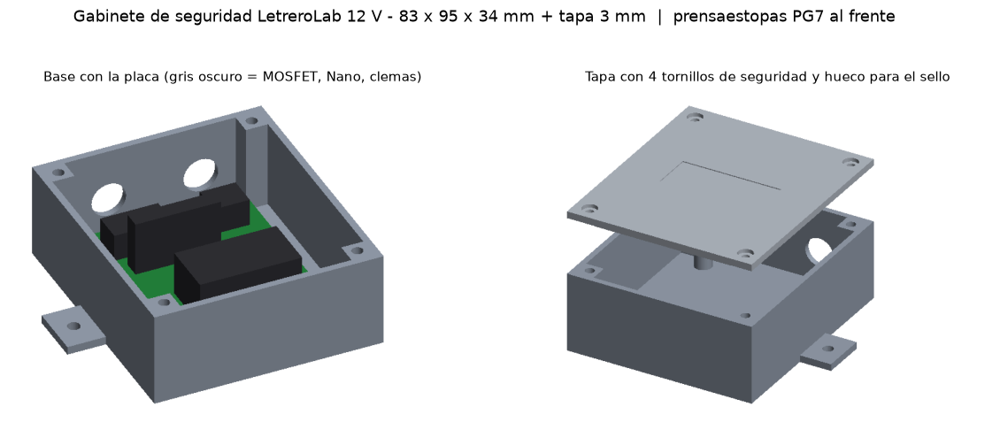

# Gabinete de seguridad para la placa base 12 V

La placa queda **cerrada con tornillos de seguridad**. Solo quien tiene la punta (nosotros) puede abrirla para garantía o reparación. Por fuera solo salen cables:

| Prensaestopa | Cables | Para |
|---|---|---|
| **ENTRADA 12V** | 2 hilos | Alimentación del eliminador |
| **SALIDAS** | 4 hilos | +12 V común y canales CH1, CH2, CH3 |



## Opción A: caja impresa en 3D (prototipo)

**Archivos:**
- `caja_base.stl`
- `caja_tapa.stl`

Medidas exteriores: **83 × 95 × 34 mm**, más una tapa de 3 mm.

**Impresión:**
- Material **PETG o ASA**: aguantan el calor dentro del letrero. El PLA se deforma a unos 55 °C, así que evítalo.
- Capa de 0.2 mm, 4 perímetros y relleno del 30 %.
- Imprime la base boca arriba y la tapa con el lado plano sobre la cama.

**Material:**

| Cant | Pieza |
|---|---|
| 8 | **Insertos de latón M3** (para termofijar, de 5.7 mm de largo): 4 en los postes de la placa y 4 en las columnas de la tapa. Se meten con la punta del cautín |
| 4 | Tornillo M3 × 6 normal, para fijar la placa a los postes |
| 4 | **Tornillo de seguridad M3 × 10 Torx con pin** (también llamado "Torx antivandálico" o "tamper proof"), para la tapa |
| 1 | Punta Torx con pin del mismo tamaño: es "la llave" |
| 2 | **Prensaestopa PG7** (para cable de 3 a 6.5 mm), en barreno de 12.5 mm |
| 1 | Etiqueta o **sello de garantía** que se rompe al despegarse (tipo "VOID"), en el hueco de la tapa |
| 2–4 | Tornillos para fijar las orejas de la caja dentro del letrero |

**Cómo queda la seguridad:**
1. El cliente no puede abrir la caja sin la punta especial.
2. El sello roto en la tapa delata si alguien la abrió, y en ese caso se anula la garantía.

La punta Torx con pin se consigue en kits de puntas. Si quieres una seguridad mayor, usa tornillos **pentalobe** o **tri-wing**, que son más raros, o mantén el sello como evidencia.

## Opción B: caja metálica comprada (más robusta)

Sirve cualquier gabinete de aluminio o de lámina con un espacio interior de al menos **72 × 84 mm** de fondo y **32 mm** de alto.

1. Usa la plantilla `plantilla_caja_metalica_1a1.pdf`: imprímela al 100 % y pégala dentro de la caja.
2. Haz los 4 barrenos de 3.2 mm en el fondo y los 2 de 12.5 mm en el frente para los prensaestopas.
3. Monta la placa sobre **separadores de nylon M3 de 8 mm**. Así el cobre nunca toca el metal.
4. Para la tapa usa los tornillos de seguridad que traiga la caja, o cámbialos por Torx con pin.

## Calor

La placa casi no se calienta: los 3 MOSFET con 2 A cada uno disipan unos 0.4 W en total, y el Nano unos 0.2 W. Por eso **la caja va cerrada, sin ventilas**. Así tampoco entran polvo ni insectos.

Con el letrero BAÑOS, que consume menos de 0.2 A, el calor es despreciable.

## Bluetooth dentro de la caja

El HC-05 parado en su zócalo mide 4.5 cm de alto y no cabe con la tapa puesta. Dentro de la caja conéctalo con **4 cables Dupont macho-hembra de 10 cm**: VCC, GND, TXD y RXD. Luego pégalo acostado en una pared con cinta doble cara.

## Regenerar

Las medidas se cambian en `gen/caja.py`. Para regenerar todo:

```
pip install manifold3d trimesh matplotlib pymupdf
python3 gen/caja.py
```
